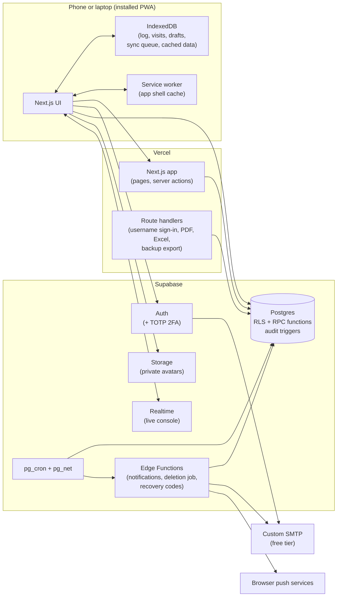
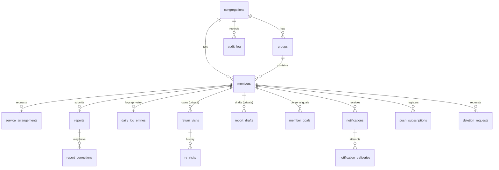

# Ministry Report: Product Requirements Document

**Product:** Ministry Report (platform) · **First congregation:** Nyamira Kingdom Hall of Jehovah's Witnesses
**Working name of the site:** *Ministry Report* · **Congregation identity:** *JW NYAMIRA*, tagline *"A people for Jehovah's Name"*

| | |
|---|---|
| **Version** | 1.0, draft for approval |
| **Date** | 19 September 2026 (Nairobi) |
| **Product owner / approver** | Ogora Delmus Mocheche (Elder) |
| **Data owner** | The congregation body (Nyamira) |
| **Builder** | To be assigned (AI-assisted build; see §17) |
| **Stack** | Next.js on Vercel · Supabase (Postgres, Auth, Storage, Realtime, Edge Functions, pg_cron) |
| **Status of inputs** | 39 discovery questions answered; pre-launch checklist adopted as the launch bar (§20) |

> **How to read this document.** §1–§3 tell you what was decided and what needs your attention before build. §4–§9 define the product. §10–§13 define the design. §14–§16 define the technology, data and security. §17–§20 define delivery and the launch bar. §21 lists every open item that still needs an answer from you. Appendices hold the SQL, the Kiswahili glossary and the environment setup.

---

## Table of contents

1. Executive summary
2. Decision log (what you told us)
3. Platform findings that change the plan
4. Goals, non-goals and success measures
5. Users and roles
6. Domain rules (the rules the system must enforce)
7. Functional requirements
8. Screens and navigation
9. Notifications and reminders
10. Design direction
11. Brand and logo specification
12. Card, PDF and Excel design specifications
13. Language (English and Kiswahili)
14. Architecture
15. Data model and access control
16. Security, privacy and data protection
17. Delivery plan and roadmap
18. Quality assurance
19. Non-functional requirements
20. Pre-launch checklist (mapped to this product)
21. Open items and assumptions
22. Appendices

---

## 1. Executive summary

### 1.1 The problem
Each month every publisher in the congregation must report their ministry. Today this is done by message, paper or memory, and an Elder compiles the totals by hand. This is slow, error-prone, and hard to audit. Publishers also have no easy personal record of their own year, and pioneers have no simple way to track hours against a goal or keep track of return visits.

### 1.2 The product
**Ministry Report** is a private, mobile-first web app (installable as a PWA) where:

- **Publishers** submit their monthly report in under a minute, keep a private daily hours log, watch progress against their goal, track return visits with reminders, and download a square PNG "report card".
- **Elders** see the whole congregation: live totals, infographics, who has not yet reported, a filterable table, corrections, an audit trail, and professional PDF and Excel exports.
- **Ministerial Servants** verify and approve new accounts.
- It is built **multi-congregation from day one**: Nyamira is congregation number one; other congregations can be added later without redesign.

### 1.3 Scope of version 1
You marked everything as necessary, so version 1 contains all of the following, delivered in phases (§17):

| Area | Included in v1 |
|---|---|
| Accounts | Sign-up with mandatory approval, username or email sign-in, mandatory cropped profile photo, 2FA for Elders and Ministerial Servants |
| Reporting | Two report forms (publisher, pioneer), locked after submission, late flag, previous-month-first rule, Elder submits on behalf |
| Corrections | Publisher requests, Elder approves, report reopens, full audit trail |
| Publisher tools | Dashboard, private daily log (hours, minutes, seconds), monthly and service-year progress bars, history, personal goals |
| Report card | Square PNG with photo and category, only after submission, works offline |
| Return visits | Private tracker with reminders (not reported, not visible to Elders) |
| Elder console | Totals, infographics, six- and twelve-month and service-year comparisons, not-reported list with one-tap reminders, filters and search, approvals, audit log, settings |
| Exports | Congregation PDF and Excel on letterhead, individual service-year record (custom design), encrypted full backup |
| Platform | PWA with offline queue, dark mode, English and Kiswahili, privacy notice and terms, public landing page |

### 1.4 What is deliberately not in version 1
Import of past reports, SMS, fully automated WhatsApp, unbaptized publishers or Bible students as users, comparisons or rankings between publishers, public share links for cards, and any territory, meeting or contribution management (§4.2).

---

## 2. Decision log (what you told us)

Every answer from the discovery worksheet is recorded here so nothing is lost between discussion and build. **Bold** entries are places where your answer differs from my recommended default. **Source column:** `Q#` is a question number from the second worksheet (the Word document you just answered); `R1-x` is your first-round answer in section x (A people, B accounts, C reports, D submission, E dashboard, F card, G admin, H data, I design, J launch, K scope).

### 2.1 People, roles and accounts

| # | Decision | Source |
|---|---|---|
| D-01 | About 50 publishers now. Multi-congregation architecture from day one; Nyamira is first. New congregations are created only by the Platform Owner. | R1-A, Q29 |
| D-02 | Two service groups: **Nyamira Town** and **Miruka Town**. Reports can be filtered by group, and a congregation-wide total is the main figure. | R1-A |
| D-03 | Baptized publishers only in v1. | R1-A |
| D-04 | Several Elder accounts allowed. Several Ministerial Servants allowed. Only the Platform Owner (you) can grant the Elder role; Elders can grant Ministerial Servant. | R1-A, Q1 |
| D-05 | Sign in with **username or email** plus password. Email is required on every account. | R1-B, Q5 |
| D-06 | Sign-up needs approval by an Elder or Ministerial Servant. Official name is required and verified by them. | R1-B |
| D-07 | Sign-up fields as proposed: official full name, username, email, phone/WhatsApp, group, current arrangement, profile photo, language, consent. | Q6 |
| D-08 | **Profile photo is mandatory** and the **user crops it themselves** (no automatic crop). | R1-B |
| D-09 | **Pioneer status needs approval** (not self-declared). | Q7 |
| D-10 | Elder may create **managed profiles** for people without phones or email and submit for them. | Q8 |
| D-11 | Two-factor authentication (authenticator app plus recovery codes) is mandatory for Elders and Ministerial Servants. You are the reset contact. | R1-H, Q9 |
| D-12 | Elders and Ministerial Servants also get the normal publisher tools. No group-overseer role. | Q3, Q4 |
| D-13 | Ministerial Servants can approve accounts only. Elders can do everything else. | R1-G, Q2 |

### 2.2 Reports, hours and goals

| # | Decision | Source |
|---|---|---|
| D-14 | Two forms: **publisher** (participated Yes/No, studies, comment) and **pioneer** for regular, auxiliary and special pioneers (whole hours, studies, comment). All three pioneer types use the same form. | R1-C, Q15 |
| D-15 | The Yes/No field is worded **"Yes / No, participated"**. A "No" locks every other field. | R1-C |
| D-16 | Monthly report hours are **whole numbers**. | R1-C |
| D-17 | **The daily log accepts hours, minutes and seconds.** Reconciling this with whole-hour reports is a design point (§6.5, OI-02). | Q12 |
| D-18 | **Both forms have a comment box**, 50 words maximum, visible to the publisher and the Elders. | R1-C, Q15 |
| D-19 | Goals: **Regular pioneer 50 hours; Auxiliary pioneer 15 or 30 (depending); Special pioneer 70.** Monthly and service-year progress bars. **Individuals can edit their own goals.** | Q13 |
| D-20 | Zero studies and zero hours are allowed. A 0-hour pioneer report is flagged to the Elder. | Q14 |
| D-21 | Category is chosen per report, limited to arrangements that have been approved (D-09). | R1-B, Q7 |
| D-22 | Service year runs September to August and is displayed as `2026-2027`. | R1-E |

### 2.3 Submission, corrections and reminders

| # | Decision | Source |
|---|---|---|
| D-23 | A report for month M can be submitted from the **last day of M** until **23:59 on the 10th of M+1** (Nairobi time). Later is allowed but shown as **Late**. | R1-D, Q10 |
| D-24 | **A member cannot submit a later month before the earlier month is reported.** Late submissions are accepted **until the end of the month** (interpretation in §6.2, OI-01). | Q10 |
| D-25 | Reports lock on submission. The publisher can send a **correction request**; on approval the report **reopens** for the publisher to fix and resubmit. The Elder can also edit directly. | R1-D, Q17 |
| D-26 | **Audit trail is mandatory.** Visible to Elders only, read-only, never deletable. An Elder editing their own report is flagged. | R1-D, Q32 |
| D-27 | Reminder schedule accepted: opening day, the 3rd, 5th, 8th, 10th, then weekly until submitted; the Elder can send extra reminders. | R1-D, Q19 |
| D-28 | **Free channels only:** in-app, push notifications and WhatsApp click-to-chat (Elder taps once per person). Email is treated as free-tier email (see OI-03). No SMS and no fully automated WhatsApp in v1. | Q18 |
| D-29 | Offline: dashboard (cached), daily log, return visits and report drafts work offline; submission queues and syncs. An offline submission counts as on time based on when the person tapped Submit. Admin tools are online-only. | Q23 |

### 2.4 Return visits, card and exports

| # | Decision | Source |
|---|---|---|
| D-30 | Private **return-visit tracker** with the proposed fields. It is never reported, never visible to Elders or Ministerial Servants, and excluded from exports and backups. Reminders by push and email on the morning of the visit and one hour before; overdue after 14 days. | R1-C, Q20–Q22 |
| D-31 | **Report card:** square PNG, with photo, category, name, month, hours and studies (or participation), in the user's language. Only after submission. Not editable. No public link. | R1-F, Q24 |
| D-32 | **A "No" report also produces a card.** | Q16 |
| D-33 | Congregation PDF and Excel on a professional letterhead, grouped Publishers / Auxiliary / Regular / Special, then a full table, with "prepared by" line and Elder signature box. English by default with a Kiswahili option. | R1-G, Q25, Q27 |
| D-34 | **Individual service-year record uses a fully custom design** (not the familiar record-card layout). | Q26 |
| D-35 | Full backup: Elder-only download (Excel plus JSON in one archive), members and reports, without return visits. | R1-H, Q28 |

### 2.5 Data, brand, hosting and launch

| # | Decision | Source |
|---|---|---|
| D-36 | Data is owned by the congregation body. Deletion requests: anonymize reports (remove name, photo, comments), keep counts, Elder approves after a 30-day grace period. Leaving members are deactivated; history is kept until they ask for deletion. | R1-H, Q30 |
| D-37 | Privacy notice and terms pages are published. Privacy contact: **Ogora Delmus Mocheche, ogoradelmus1@gmail.com** (see R-08). Approval to launch: Ogora Delmus Mocheche. | R1-H, Q31 |
| D-38 | Logo direction **(a)**: a "JW" monogram in a rounded shield with "NYAMIRA" beneath. Original artwork, not a copy of the official logo. | Q33 |
| D-39 | Kiswahili drafted by us, reviewed by you. Dark mode included. Mobile-first with tablet and laptop layouts. PWA mandatory, usable on weak internet. | R1-I, Q34 |
| D-40 | **Platform brand is "Ministry Report"**; Nyamira is just the first congregation. Domain to be bought later; **for now the site runs on the Vercel address**. The landing page **may show meeting times and address**. | Q35 |
| D-41 | **Supabase Free and Vercel free (Hobby) for now; Pro later.** | Q36 |
| D-42 | **"For now we will use Supabase" for email.** This cannot work for publishers (R-01, OI-03). | Q37 |
| D-43 | Launch approach: pilot with about five Elders and Ministerial Servants, then the congregation. September 2026 named as the first reporting month (see R-05). Second Elder as recovery co-owner of all accounts. | Q38, Q39 |
| D-44 | No comparisons or leaderboards between publishers. | R1-K |

---

## 3. Platform findings that change the plan

I checked the free-tier facts your answers depend on. Sources are official documentation or recent pricing guides; confirm current figures on each provider's site before committing money.

### 3.1 Summary

| ID | Finding | Impact | What the PRD does about it |
|---|---|---|---|
| **R-01** | **Supabase's built-in email only delivers to addresses that are members of your Supabase organization, is limited to about 2 messages per hour, and is documented as not for production.** | Ordinary publishers would never receive sign-up confirmation or password-reset emails. Your decision "use Supabase email for now" (D-42) will not work for anyone except you. | Configure **custom SMTP** (a free provider) before any publisher signs up. Recommended: Brevo free plan (300 emails/day, no card). Interim fallback: Elder-generated recovery link (§16.3). **Needs your decision: OI-03.** |
| **R-02** | **Vercel Hobby cron jobs run at most once per day** (with up to an hour of timing drift), and Hobby is for non-commercial, personal use. | Reminders such as "one hour before a return visit" cannot run on Vercel cron. | **All scheduling runs in Supabase** (`pg_cron` plus Edge Functions). Vercel cron is not used. A congregation's non-profit tool plausibly qualifies as non-commercial; confirm against Vercel's terms, and upgrade if in doubt. |
| **R-03** | **Supabase Free projects pause after one week of inactivity and have no managed daily backups.** Limits are roughly 500 MB database, 1 GB file storage and 5 GB egress a month. Pro (about US$25 a month) removes pausing and adds daily backups kept for 7 days. | A records system that can go offline, or lose data with no restore point, is not acceptable for congregation records. Capacity itself is fine: 50 members with photos and reports use a few megabytes. | **Upgrade to Pro before the congregation-wide launch** (Phase 4 gate G-4). Until then a monthly encrypted backup is mandatory (§16.6). Whether internal cron activity prevents pausing is not documented, so we do not rely on it. |
| **R-04** | **No custom domain yet.** | The checklist's canonical URLs, sitemap, email sender authentication and social-share links all depend on the domain. | Everything is driven by one setting, `SITE_URL`. While on `*.vercel.app` the whole site is `noindex`, so a temporary address never gets indexed. Domain is a launch gate (G-3) unless you waive it in writing. |
| **R-05** | **Timeline conflict.** Today is 19 September. September's window opens on **Wednesday 30 September**, only 11 days away, and a pilot week does not fit before it. | A rushed build would compromise security and correctness, which matter more than a date. | Recommended: treat **October 2026 (window opens Saturday 31 October)** as the first fully live month. September reports are captured by Elder on-behalf entry or, if Phase 1 is ready, submitted as late reports (open until 31 October). **Needs your decision: OI-04.** |
| **R-06** | **Rule interaction can lock someone out.** "No later month before the earlier one" plus "late reports only until end of month" means a person who misses a month could never submit again. | Publishers stuck, Elders flooded with requests. | Elder tool **Close month as not reported** and **Submit on behalf** resolve any stuck month; both are audited (§7.7). See OI-01. |
| **R-07** | **Daily log in minutes and seconds vs. monthly report in whole hours.** | Leftover minutes need a rule. | Report hours = whole hours from the log; the remainder can carry over to next month (default on). See §6.5 and OI-02. |
| **R-08** | **Sensitive data.** Religious activity is personal data that the Kenya Data Protection Act, 2019 treats with extra care. Contact is a personal Gmail address. Hosting is outside Kenya. Some baptized publishers may be under 18. | Legal duties (registration, consent, transfers, children's data) may apply. I am not a lawyer. | Privacy-by-design controls (§16); consent records; a minors rule (OI-06); a recommendation to have a qualified adviser review the privacy notice and registration duties before launch; a role-based email address once the domain exists. |
| **R-09** | **Push notifications on iPhone only work after the app is installed to the Home Screen** (iOS 16.4 or later), and push delivery is never guaranteed. | Some publishers would miss reminders. | Reminders always also appear in-app; the Elder's WhatsApp click-to-chat list is the safety net; install is guided (§9.4). |
| **R-10** | **Single point of failure.** One Owner account controls everything. | If you are unavailable, the system cannot be recovered. | Second Elder as recovery co-owner on Vercel, Supabase and the domain; 2FA; recovery codes stored offline by two Elders (D-43). |
| **R-11** | **Return-visit privacy has a technical limit.** Row-level security keeps the data from every user, including Elders, but whoever administers the Supabase project can still read the database. | Details of non-members could be seen by an administrator. | Minimize what is stored (first name only), document the limit in the privacy notice, and add column-level encryption as a later hardening item (§16.5). |
| **R-12** | **Logo and trademark.** A "JW" monogram is close to the official mark. | Brand or legal complaints. | Original artwork with distinct lettering and shape; no official box, colours pattern or font copied; the body of elders approves the emblem before launch (gate G-5). |

### 3.2 Recommended budget (all figures to be confirmed at purchase)

| Item | When | Approx. cost |
|---|---|---|
| Supabase Pro | Before congregation-wide launch | about US$25 per month |
| Domain (`.co.ke` or `.app`) | Before congregation-wide launch | about US$10–25 per year |
| Email (Brevo free tier) | Before the first publisher signs up | free (300 emails per day) |
| Vercel Hobby | Now | free (upgrade only if terms or limits require) |
| SMS / automated WhatsApp | Not in v1 | not applicable |

---

## 4. Goals, non-goals and success measures

### 4.1 Goals

| ID | Goal |
|---|---|
| GL-1 | A publisher can submit a monthly report in **under 60 seconds** on a mid-range Android phone over a weak connection. |
| GL-2 | An Elder can see complete, accurate congregation totals for a month in **under 10 seconds**, with no manual compiling. |
| GL-3 | **No report is ever lost or silently changed.** Every change is audited; offline submissions are never dropped. |
| GL-4 | Personal and sensitive data is visible **only to the people who need it** (§5.3), and each congregation is fully isolated from every other. |
| GL-5 | The app is **installable, fast and usable offline** for the everyday tasks (logging hours, return visits, drafting a report). |
| GL-6 | The exports look **professional enough to keep as official congregation records**. |
| GL-7 | The design is **calm, trustworthy and clearly blue and gold**, works in light and dark, in English and Kiswahili. |

### 4.2 Non-goals for version 1

- Importing past reports (Excel, paper, WhatsApp).
- SMS reminders and fully automated WhatsApp messages (the architecture leaves room for both).
- Unbaptized publishers, children and Bible students as users.
- Any comparison, ranking or "top publisher" view between individuals.
- Public links to report cards, or any public data.
- Territory, meeting scheduling, literature, or contribution management.
- Native iOS or Android store apps (the PWA is the app).

### 4.3 Success measures (proposed targets; adjust to taste)

| Measure | Target | How measured |
|---|---|---|
| Active publishers who report each month | 95% or more within 3 months of launch | Reports vs. active members |
| Reports submitted on time (by the 10th) | 80% or more | `is_late = false` share |
| Elder time to compile a month | Under 10 minutes including export | Owner feedback at pilot end |
| Lost or duplicated reports | Zero | Audit review, sync tests |
| Cross-congregation or cross-user data leaks | Zero | Automated RLS test suite must pass on every release |
| Installs as PWA | 60% or more of active users | Installed-display-mode events (no third-party tracker) |
| Offline sync success | 99% or more of queued actions synced without support | Client sync log counts |

---

## 5. Users and roles

### 5.1 Who uses it

| Persona | Typical device | Needs |
|---|---|---|
| **Publisher** | Android phone, limited data bundles | Report quickly, see own record, get a reminder, download a card |
| **Pioneer** (regular, auxiliary, special) | Phone, sometimes laptop | Log hours daily, see progress to goal, report with comment |
| **Ministerial Servant** | Phone | Verify and approve new accounts |
| **Elder** | Phone and laptop | See every report, chase missing ones, correct errors, export records |
| **Platform Owner** | Laptop | Create congregations, grant the Elder role, keep the platform healthy |
| **Managed member** | No device | Has a profile so an Elder can submit for them |

### 5.2 Roles

Roles are cumulative: every Elder and Ministerial Servant is also a publisher and gets the publisher tools (D-12).

| Role | Meaning |
|---|---|
| `publisher` | Standard member. Sees only their own data. |
| `ministerial_servant` | Publisher who can also approve or reject **account requests** (D-13). Cannot see any report. |
| `elder` | Full congregation administration, including reports, corrections, reminders, exports and settings. |
| `platform_owner` | Lives outside congregations. Creates congregations and grants the Elder role. In Nyamira you are also an Elder. |

### 5.3 Permissions matrix

`Own` = only the person's own data. `All` = everyone in the same congregation. A dash means no access.

| Capability | Publisher | Min. Servant | Elder | Platform Owner |
|---|---|---|---|---|
| Request access (sign up) | Yes | Yes | Yes | n/a |
| Edit own photo, phone, language, personal goal | Own | Own | Own | Own |
| Change own **official name** or username | Request | Request | Request | Request |
| Approve or reject account requests | none | **All** | All | none |
| Approve pioneer arrangements | none | none | **All** | none |
| Grant or remove Ministerial Servant role | none | none | All | none |
| Grant or remove Elder role | none | none | none | **Yes** |
| Create managed profiles | none | none | All | none |
| Own daily log, drafts, return visits | Own | Own | Own | Own |
| Own dashboard, history, card, personal record PDF | Own | Own | Own | Own |
| Submit own monthly report | Own | Own | Own | Own |
| Submit a report **on behalf of** someone | none | none | All | none |
| Close a month as "not reported" | none | none | All | none |
| Request a correction to own report | Own | Own | Own | Own |
| Approve or decline corrections; edit locked reports | none | none | All | none |
| See any other person's report or comment | none | none | All | none |
| Congregation totals, infographics, comparisons | none | none | All | none |
| "Not reported" list and reminder triggers | none | none | All | none |
| Export congregation PDF or Excel; export any individual record | none | none | All | none |
| Full backup download | none | none | All | none |
| Read the audit log | none | none | All | none |
| Approve deletion requests | none | none | All | none |
| Edit congregation settings (goals, groups, landing details) | none | none | All | none |
| **See anyone's return visits or daily log** | **none** | **none** | **none** | **none** |
| Create and manage congregations | none | none | none | Yes |

The last row is a hard rule: return visits and daily logs are private to their owner (D-30, D-44).

### 5.4 Two-factor authentication

- Mandatory for `elder` and `ministerial_servant`, using an authenticator app (TOTP). It is checked on every admin action, not only at sign-in (§16.2).
- Ten one-time recovery codes are shown once at enrollment; the person stores them offline.
- If someone loses both device and codes, the Platform Owner resets the factor after confirming identity in person or by phone.
- Publishers can optionally enable 2FA.

---

## 6. Domain rules (the rules the system must enforce)

These rules are enforced **in the database**, not only in the screens, so no client can bypass them (§15.4).

### 6.1 Time and calendar

- Time zone for every rule: **Africa/Nairobi (UTC+3, no daylight saving)**. Stored as UTC, displayed in Nairobi time.
- **Service year** runs 1 September to 31 August and is written `2026-2027`. The current service year (as of 19 September 2026) is `2026-2027`.
- A **report month** is a calendar month, stored as the first day of the month (for example `2026-08-01`).

### 6.2 Submission window

For report month **M**:

| Moment | Rule |
|---|---|
| **Opens** | 00:00 on the **last day of M** |
| **On time until** | 23:59:59 on the **10th of M+1** |
| **Late until** | 23:59:59 on the **last day of M+1** (self-service). Reports are accepted and marked **Late** after the 10th. |
| **After that** | Self-service is closed; an Elder submits on behalf or closes the month (§7.7) |

**Worked example (2026):**

| Report month | Opens | On time until | Late until |
|---|---|---|---|
| August 2026 | Mon 31 Aug | Thu 10 Sep | Wed 30 Sep |
| **September 2026** | **Wed 30 Sep** | **Sat 10 Oct** | **Sat 31 Oct** |
| October 2026 | Sat 31 Oct | Tue 10 Nov | Mon 30 Nov |

> **Interpretation to confirm (OI-01).** Your answer to "how far back can late reports go" was *"Default. Till end month."* I read this as: the default (any month since the account was created) is replaced by a self-service late window that ends on the last day of the month after the report month. The window length is a setting (`late_window_months`, default 1), so changing it later needs no code change.

### 6.3 Order of reporting

- A member may submit month **M** only when every earlier reportable month is either **submitted** or **closed as not reported** (D-24).
- A member's first reportable month defaults to the month their account was created. The approver can set it earlier when approving (for example, someone who joins on 3 October but should still report September).
- Consequence: the "current month" form opens only when nothing earlier is outstanding.

### 6.4 Report status

| Status | Meaning | Counts in totals |
|---|---|---|
| `submitted` | Locked. Submitted by the member or on their behalf. | Yes |
| `reopened` | An approved correction is being edited by the publisher. The previous values stay visible to the Elder. | Yes (with the last submitted values until resubmitted) |
| `not_reported` | An Elder closed the month because no report will come. Unblocks later months. | No; shown as "did not report" |

A report is marked **Late** if it was submitted after 23:59:59 on the 10th of M+1. For offline submissions the moment is the time the person tapped **Submit** (recorded on the device and sanity-checked against the server, §14.6).

### 6.5 Hours: daily log versus monthly report

| Item | Rule |
|---|---|
| Daily log entry | A date plus a duration in hours, minutes and seconds (stored as seconds). Optional short private note (140 characters). |
| Month total | Sum of that month's entries, shown as `H:MM`. |
| Report form pre-fill | **Whole hours = floor(total ÷ 3600).** The publisher may change it before submitting (D-16). |
| Left-over minutes | **Carry-over (default on):** if the reported hours equal the whole hours from the log, the remainder is added to next month's log as a dated system entry ("Carried over from August"). If the publisher edited the total, no carry-over is created. Setting: **Carry over leftover minutes**. |
| Limits | One entry up to 24 hours. Report hours up to 744 (hard); a confirmation appears above 300. |

> **Assumption to confirm (OI-02).** Whole-hour reports plus a minute-level log needs a rule for the remainder. Carry-over matches how many publishers already treat leftover minutes, but it is your congregation's call.

### 6.6 Categories, arrangements and goals

- Four report categories: **Publisher**, **Auxiliary pioneer**, **Regular pioneer**, **Special pioneer**.
- Pioneer categories require an **approved arrangement** covering that month (D-09). The publisher requests it (type, start month, optional end month, and for auxiliary a goal of 15 or 30); an Elder approves. Pending, rejected and ended arrangements never appear as report options.
- Report form choices for a month = "Publisher" plus any approved arrangement covering that month. The choice is recorded on the report.

| Category | Default monthly goal | Notes |
|---|---|---|
| Regular pioneer | 50 hours | Service-year goal = sum of monthly goals (12 × 50 = 600 for a full year) |
| Auxiliary pioneer | **15 or 30 hours** | Chosen by the publisher for that arrangement |
| Special pioneer | 70 hours | 12 × 70 = 840 for a full year |
| Publisher | none | No hours; shows participation and studies only |

- **Goals are editable by the individual (D-19).** A personal goal overrides the default for that person and month. The default figures above are congregation settings that an Elder can change.
- A **snapshot of the goal** is saved on each submitted report so history does not change when goals change later.
- **Service-year goal** = the sum of the monthly goals for the months in the year (using the goal in force each month). Publisher-only months add nothing.

### 6.7 Report content rules

| Field | Publisher form | Pioneer form |
|---|---|---|
| Category | Publisher | Auxiliary / Regular / Special (from approved arrangement) |
| Participated | **Yes / No** (required) | Not asked; derived: hours above 0 means participated |
| Hours | Not shown | Whole number, 0 or more |
| Studies | Whole number 0–99, only if Yes | Whole number 0–99 |
| Comment | Up to 50 words, only if Yes | Up to 50 words |

- **"No" locks everything else** (D-15): studies set to 0, comment cleared and disabled.
- **Zero values are allowed** (D-20). A pioneer report with 0 hours is accepted and flagged to the Elder.
- **Word count:** words are runs of characters separated by spaces or line breaks; the 51st word blocks submit. Plain text only. A small notice reminds people not to write private details about other people.
- **Comment visibility:** the publisher and Elders only (D-18).

### 6.8 Locking, corrections and audit

1. Submission locks the report (D-25). Values can no longer be edited by the publisher.
2. The publisher can tap **Request correction**, choose what is wrong, and give a reason (up to 300 characters).
3. An Elder reviews it. **Approve** reopens the report for the publisher to fix and resubmit; **Decline** records a reason. The Elder can also edit directly with a required reason.
4. Every step writes an audit entry (who, when, what changed, before and after values, reason).
5. **An Elder editing their own report** is allowed but flagged in the audit log and highlighted in the Elder console.

### 6.9 Member lifecycle

| Status | How reached | Effect |
|---|---|---|
| `pending` | Sign-up submitted | Can sign in to the "Complete your request" (photo) and "Waiting for approval" screens only |
| `active` | Approved by an Elder or Ministerial Servant | Full publisher access |
| `inactive` | Elder marks moved, stopped, or deceased | Cannot sign in. History kept. Not counted as "did not report" from the effective month. |
| `rejected` | Request declined with a reason | Cannot use the app; can request again |
| `anonymized` | Deletion approved and completed (§16.7) | Identity removed; numbers kept |

A managed profile (no login) is always `active` until made `inactive`, and appears in "not reported" lists like any member.

---

## 7. Functional requirements

Phase codes: **P1** Core, **P2** Engagement, **P3** Insight and records, **P4** Hardening and launch (§17). Every requirement is testable; acceptance notes follow the tables that need them.

### 7.1 Accounts and sign-in

| ID | Requirement | Phase |
|---|---|---|
| AUTH-01 | Public **Request access** is a two-step flow. **Step 1 (before sign-in):** official full name, username, email, phone/WhatsApp, group (Nyamira Town or Miruka Town), current arrangement (Publisher, Regular, Auxiliary or Special pioneer), language (English or Kiswahili), password, and a consent tick that links to the privacy notice and terms. The person then confirms their email. **Step 2 (first sign-in):** the person adds and crops their **profile photo** (PRO-01). Photo upload needs a signed-in session, which is why it comes after email confirmation. The request appears in the Approvals queue **only once the photo is uploaded**. | P1 |
| AUTH-02 | **Username** rules: 3–24 characters; lowercase letters, digits, `.` `_` `-`; unique regardless of case; reserved words blocked (`admin`, `elder`, `support`, and similar). | P1 |
| AUTH-03 | **Password** rules: at least 10 characters, no composition rules, a strength meter, and a check against a list of very common passwords. | P1 |
| AUTH-04 | Sign in with **username or email** plus password in one field. The server resolves a username to its email; the email is never returned to the browser. Error messages are identical for "no such user" and "wrong password". | P1 |
| AUTH-05 | **Throttling:** after 5 failed attempts for the same identifier or the same network address within 15 minutes, further attempts are refused for 15 minutes. | P1 |
| AUTH-06 | Email confirmation is on, so the address is proven to belong to the person (needed for reminders). Requires working SMTP (R-01, OI-03). | P1 |
| AUTH-07 | **Password reset** by email. If a person cannot receive email, an Elder can generate a one-time recovery link to hand over in person (audited). Elders never see or set another person's password. | P1 |
| AUTH-08 | Pending accounts can sign in to a **"Complete your request"** screen (photo step) and then a **"Waiting for approval"** screen, and nothing else. No congregation data is reachable (enforced by database rules, not just the screen). | P1 |
| AUTH-09 | **Two-factor enrollment** is forced at first sign-in for Elders and Ministerial Servants, and admin screens require a verified second factor (§16.2). Ten recovery codes are issued once. | P1 |
| AUTH-10 | Sign out clears the session and **wipes cached personal data on that device** (offline store, cached photo). A "This is a shared device" option keeps nothing after sign-out. | P2 |

**Acceptance (AUTH-04):** a test that submits 100 random usernames cannot distinguish existing from non-existing ones by response text or timing beyond normal variance.

### 7.2 Account approval

| ID | Requirement | Phase |
|---|---|---|
| APR-01 | Elders and Ministerial Servants see a live **Approvals queue** (complete requests only: email confirmed and photo uploaded) with a count badge. Each request shows the photo, official name, username, email, phone, group, requested arrangement and how long it has waited. | P1 |
| APR-02 | **Approve** lets the approver confirm the official name and group, and set the person's **first reporting month**. **Reject** requires a reason that is shown to the person. **Ask for a new photo** returns the request to the person with a note. | P1 |
| APR-03 | A requested pioneer arrangement is **not** approved by this step. It appears in a separate queue that only Elders can act on (D-09). Until then the person reports as Publisher. | P1 |
| APR-04 | Approval and rejection notify the person by in-app message and email (and push if enabled). | P1 |
| APR-05 | A person cannot approve their own request. The Platform Owner creates the first Elder of a new congregation. | P1 |
| APR-06 | Every decision is audited with the approver's name, time and reason. | P1 |

### 7.3 Profile, photo and arrangements

| ID | Requirement | Phase |
|---|---|---|
| PRO-01 | The **profile photo is mandatory** for signed-up members (not for managed profiles). The person **crops it themselves**: a square crop with drag, pinch-to-zoom and a live circular preview. No automatic cropping. | P1 |
| PRO-02 | The cropped image is re-encoded on the device to **512 by 512 WebP, 120 KB or less**. This strips location and camera data. Non-images and files over 8 MB before cropping are refused with a clear message. | P1 |
| PRO-03 | Photos are stored in a **private** bucket and shown through short-lived signed links (§14.4). Photos are visible only to the person and to Elders. | P1 |
| PRO-04 | A person can change their photo, phone, language and theme at any time. Changing **official name** or **username** creates a request that an Elder approves (D-06). | P1 |
| PRO-05 | **Arrangements:** a person can request Auxiliary, Regular or Special pioneer service for a month range. For Auxiliary they pick a goal of 15 or 30 hours. An Elder approves, declines with a reason, or ends it. An Elder can also create one directly. | P1 |
| PRO-06 | **Personal goal:** a pioneer can set their own monthly goal for the current or a future month. The default from §6.6 applies until they do. | P2 |
| PRO-07 | **Data controls** page: download my data (JSON), request account deletion (§7.13), see which consent versions I accepted. | P3 |

### 7.4 Monthly report

| ID | Requirement | Phase |
|---|---|---|
| REP-01 | The Report screen shows **only the month that may be reported now**: the earliest month that is open and not yet reported (§6.3). Other months are listed as "Not open yet" or "Reported". | P1 |
| REP-02 | A banner shows the window state: "Opens on 30 September", "Open: on time until 10 October, 23:59" or "Late: reporting is still open until 31 October". | P1 |
| REP-03 | **Publisher form:** a large two-button **Yes / No, participated**; if Yes, a studies stepper (0–99) and a comment box with a live word counter (limit 50). If No, all other fields lock and the comment clears. | P1 |
| REP-04 | **Pioneer form:** category picker (only shown if more than one approved option), whole hours (pre-filled from the daily log with a note "from your log: 42 h 35 min"), studies, comment. | P1 |
| REP-05 | A **review step** shows the values and the window state, then a confirmation: "You cannot edit this after submitting. You can ask an Elder to reopen it." | P1 |
| REP-06 | On success the person sees the confirmation with the time, and a button to **create the report card** (§7.8). | P1 |
| REP-07 | **Drafts** save automatically on the device and, when online, to the person's private draft store so they can continue on another device. Elders cannot see drafts. | P2 |
| REP-08 | **Offline submit:** the report is validated on the device and placed in a queue. The screen says "Saved on this phone. It will be sent when you are online." When synced, the server records the time the person tapped Submit as the submission moment (§14.6). | P2 |
| REP-09 | All rules in §6 (window, order, "No" locking, word limit, whole numbers, category from approved arrangement) are enforced again **in the database** and the server returns a specific message on failure. | P1 |
| REP-10 | **Idempotent submission:** the same submit sent twice (a double tap or a retry after a poor connection) creates one report. | P1 |
| REP-11 | Zero hours for a pioneer requires an extra confirmation ("You are reporting 0 hours") and flags the report for the Elder. | P1 |

### 7.5 Daily log, goals and progress

| ID | Requirement | Phase |
|---|---|---|
| LOG-01 | **Quick add:** date (defaults to today), duration in hours, minutes and (optionally) seconds, optional note (140 characters). Adding takes two taps from the dashboard using a "+" button and preset chips (30 min, 1 h, 2 h). | P2 |
| LOG-02 | Entries can be edited or deleted until the month is submitted. After submission the month's log is read-only. | P2 |
| LOG-03 | **Monthly progress bar** shows hours logged against the monthly goal and moves when an entry is added (§10.6). A text alternative always states the numbers, for example "38 of 50 hours, 76 percent". | P2 |
| LOG-04 | **Service-year progress bar** shows hours to date in the service year against the service-year goal, with a monthly bar chart underneath. | P2 |
| LOG-05 | The bars use the approved arrangement's goal, or the person's personal goal if set (§6.6). Publishers without a pioneer arrangement do not see hour bars. | P2 |
| LOG-06 | The log is **private**: only the owner can read it. It is never included in exports or backups, and Elders cannot see it (§5.3). | P2 |
| LOG-07 | Works fully offline; entries get a device-generated ID so a retry never creates duplicates. | P2 |
| LOG-08 | Leftover-minute **carry-over** (§6.5) creates a system entry on the 1st of the next month, clearly labelled and deletable by the owner. | P2 |

### 7.6 Publisher dashboard and history

| ID | Requirement | Phase |
|---|---|---|
| DSH-01 | **Home** shows, in order: the current report status card with the primary action (Report now / Reported / Opens on …); the monthly progress bar (pioneers); return visits due today; any unread messages. | P1 (status), P2 (rest) |
| DSH-02 | **History:** every past report in a list grouped by service year, with category, participation or hours, studies, on-time or late, and the comment. Tapping a row shows the full report and the correction-request action. | P1 |
| DSH-03 | **Service-year totals** for the person: months reported, total hours (pioneers), total studies, months participated (publishers). | P2 |
| DSH-04 | **Trend charts**: hours per month and studies per month for the current and previous service year, each with a "view as table" option. | P2 |
| DSH-05 | Empty and first-time states explain the next step in plain words (for example "Your first report opens on 30 September"). | P1 |
| DSH-06 | **No other person's data** ever appears here. There are no comparisons (D-44). | P1 |
| DSH-07 | A quiet **offline indicator** and a **sync status** ("2 items waiting to send") appear when relevant. | P2 |

### 7.7 Corrections and Elder actions on reports

| ID | Requirement | Phase |
|---|---|---|
| COR-01 | From a locked report the publisher taps **Request correction**, picks what is wrong (hours, studies, participation, comment, other) and gives a reason (300 characters). Only one open request per report. | P2 |
| COR-02 | Elders see a live **Corrections queue** with the current values, the reason, and buttons **Approve and reopen**, **Edit directly** (reason required) and **Decline** (reason required). | P2 |
| COR-03 | On approval the report becomes `reopened`. The publisher is notified, edits, and resubmits. The original values stay in the audit trail. A reopened report has no extra deadline, but the Elder can see how long it has been open. | P2 |
| COR-04 | **Submit on behalf (D-10):** an Elder picks a member (including managed profiles), a month, enters the values, and records **when the report was received** (default: now; an Elder may set an earlier date, within the window, to reflect a message received on time). Lateness uses the received time. The report shows "Submitted by Elder [name] on behalf". | P1 |
| COR-05 | **Close month as not reported:** for a stuck month an Elder records that no report will come. It unblocks the person's later months, appears as "did not report" in totals, and can be reversed by submitting on behalf. | P1 |
| COR-06 | The Elder console flags: reports with 0 hours, reports edited by their own author, reports corrected after submission, and on-behalf submissions. | P2 |

### 7.8 Report card

| ID | Requirement | Phase |
|---|---|---|
| CARD-01 | After submission, **Download report card** creates a **1080 × 1080 PNG** (square) showing the congregation logo and tagline, the person's photo, name and category, the month and year, and **hours and studies** (pioneers) or **Yes/No participation and studies** (publishers). Design in §12.1. | P2 |
| CARD-02 | A **"No" report also produces a card** (D-32), with neutral wording ("Did not participate this month") and no studies row. | P2 |
| CARD-03 | The card is **read-only**: no field can be hidden or edited (D-31). Comments never appear on it. | P2 |
| CARD-04 | The card follows the person's language (English or Kiswahili). It is generated **on the device** from cached report data, so it works offline. | P2 |
| CARD-05 | Cards can be re-downloaded from History at any time. There is no public link and the image is never stored on the server (D-31). | P2 |
| CARD-06 | File name: `ministry-report-2026-08-<username>.png`. The Share button uses the phone's share sheet where available (for WhatsApp), otherwise downloads. | P2 |

### 7.9 Return visits (private)

| ID | Requirement | Phase |
|---|---|---|
| RV-01 | A **Visits** tab lists return visits in four views: **Today**, **Upcoming**, **Overdue**, **All**, with search. | P3 |
| RV-02 | **Add or edit a return visit** with: householder first name, phone (optional), area or landmark, date first met, topic discussed, literature left, interest level (1–5), status (Interested, Study started, Not interested, Moved), next-visit date and time, notes. Only first name is stored; the form warns against entering surnames or private details. | P3 |
| RV-03 | Each visit has a **history**: every time the publisher logs a visit (date, notes, outcome, next visit), the RV's last-visited date and next-visit date update. | P3 |
| RV-04 | **Reminders (D-30):** a push notification and an email at **07:00** on the day of the planned visit and **one hour before** the planned time. If the RV has a planned time earlier than 08:00, only the "one hour before" reminder is sent. A visit **overdue after 14 days** without a logged visit shows an "Overdue" chip and appears in the Overdue view. | P3 |
| RV-05 | Quick actions: call, WhatsApp click-to-chat, open in maps search (by the area text), mark visited. | P3 |
| RV-06 | Return visits work **fully offline** and sync later. | P3 |
| RV-07 | Return visits are **never** reported, never visible to any other user including Elders, Ministerial Servants and the Platform Owner through the app, and are excluded from exports and backups (D-30). The person can download their own return visits and delete any of them. | P3 |
| RV-08 | Return-visit reminder text is **generic in notification previews** ("You have a visit planned at 4:00 pm") and never includes the householder's name on the lock screen. | P3 |

### 7.10 Elder console

The console is reachable only by Elders (Ministerial Servants see just the Approvals queue) and requires a verified second factor.

| ID | Requirement | Phase |
|---|---|---|
| ADM-01 | **Overview** for a chosen month (default: the latest month whose window is open or just closed). KPI tiles: active members, reported, not yet reported, reporting percentage, late reports, total hours, total studies, publishers who participated, pioneers by type. | P3 |
| ADM-02 | **Category breakdown** mirroring the usual grouping: **Publishers, Auxiliary pioneers, Regular pioneers, Special pioneers**, each with number reporting, hours (pioneers), and studies; and a **Congregation total** line. | P3 |
| ADM-03 | **By group:** Nyamira Town, Miruka Town, and the congregation total. Totals are the main figure; groups are a filter and a breakdown. Groups are never ranked (D-44). | P3 |
| ADM-04 | **Infographics** (all with a "view as table" fallback): reporting progress ring with group split; hours by category; studies trend; on-time versus late; pioneer goal attainment (counts only, no names); cumulative hours across the service year. | P3 |
| ADM-05 | **Comparisons:** this month against the previous month and against the same month last year; a **6-month** and **12-month** trend for hours, studies, reporting percentage and participants; **service-year to date** against the previous service year. | P3 |
| ADM-06 | **Reports table** with columns: name, group, category, participated or hours, studies, status (On time, Late, Reopened, Did not report), submitted at, flags, and a comment indicator. **Filters:** month or range, service year, category, group, status, flag. **Search** by name. Default order: name A to Z. Tapping a row opens a drawer with the full report, the comment and its audit history. | P1 (basic), P3 (full) |
| ADM-07 | **Not reported** list for a month: everyone obligated who has not submitted or been closed, with days left or days overdue. Actions: **Remind** (in-app plus push plus email), **WhatsApp** (opens WhatsApp with a ready message in the person's language, one tap per person), **Remind all selected**, **Submit on behalf**, **Close month**. A person can be manually reminded at most once per 24 hours. | P2 |
| ADM-08 | **Members** list: status, role, group, arrangement, first reporting month, last sign-in. Actions: change group, grant or remove Ministerial Servant (Elder), mark inactive, create managed profile, generate recovery link. | P1 |
| ADM-09 | **Approvals** and **Arrangements** queues (§7.2, §7.3) and the **Corrections** queue (§7.7), each with a live count. | P1 |
| ADM-10 | **Audit log** viewer: search and filter by person, action, date, and record. Read-only. Exports are logged too. | P1 |
| ADM-11 | **Settings** (§7.14). | P3 |
| ADM-12 | The console updates **live**: a newly submitted report, approval request or correction request appears without refreshing (§14.5). | P2 |

### 7.11 Exports and backup

All exports are generated on the server **under the signed-in Elder's own session**, are not stored, and each one is recorded in the audit log (who, what, when, which filters).

| ID | Requirement | Phase |
|---|---|---|
| EXP-01 | **Monthly congregation report (PDF and Excel).** Choose month, language (English default, Kiswahili option), and whether to include comments (off by default) and the not-reported list (on by default). Layout in §12.2. | P3 |
| EXP-02 | **Service-year summary (PDF and Excel):** month-by-month totals by category for the service year. | P3 |
| EXP-03 | **Individual service-year record (PDF)** for any member (Elder) or for oneself (any member): a fully custom design (§12.3). | P3 |
| EXP-04 | **Full backup:** an encrypted archive containing an Excel workbook and JSON files for members, arrangements, reports, corrections, audit log and settings. Return visits and daily logs are **excluded**. The Elder chooses a passphrase at export time; the archive uses AES-256. | P3 |
| EXP-05 | **Audit log export** (Excel). | P3 |
| EXP-06 | Filenames: `ministry-report_nyamira_2026-08_congregation.pdf`, and similar. | P3 |
| EXP-07 | Every exported page carries the congregation letterhead, a generated-at timestamp, "prepared by [Elder name]", and the footer "Confidential: congregation record". | P3 |

### 7.12 Public site and legal pages

| ID | Requirement | Phase |
|---|---|---|
| PUB-01 | **Landing page** (`/`): logo, congregation name, tagline, **Sign in** and **Request access** buttons, an **Install app** button with plain instructions for Android and iPhone, the **meeting days, times and Kingdom Hall address** (from settings, D-40), and links to Privacy notice and Terms. Simple and quick. Layout in §8.2. | P1 |
| PUB-02 | **Privacy notice** and **Terms** in English and Kiswahili, versioned; acceptance is recorded at sign-up (§16.4). Draft text is written by us and **must be reviewed by a qualified adviser** before launch (R-08). | P1 |
| PUB-03 | Standard pages: custom 404 and error pages, offline fallback page, `robots.txt`, `sitemap.xml`, `llms.txt`, web manifest, `security.txt`. Details in §20. | P1 |
| PUB-04 | Only the landing page and the two legal pages are indexable. Every signed-in page carries `noindex`. | P1 |

### 7.13 Deletion and leaving

| ID | Requirement | Phase |
|---|---|---|
| DEL-01 | A member can **request deletion** from Data controls. The request enters a **30-day grace period** during which the member can cancel. | P3 |
| DEL-02 | After the grace period an Elder gives final approval. A scheduled job then **anonymizes** the member: name replaced with "Former publisher", photo, phone, email, username and comments deleted, daily log, return visits, drafts, notification history and push subscriptions deleted, sign-in account removed. Numeric report rows stay so past congregation totals remain correct (D-36). | P3 |
| DEL-03 | An Elder can mark a member **inactive** (moved away, stopped, deceased). History is kept until the person asks for deletion. | P1 |
| DEL-04 | Audit entries keep the pseudonymous ID but display the anonymized name after deletion. | P3 |

### 7.14 Congregation settings (Elder)

| ID | Requirement | Phase |
|---|---|---|
| SET-01 | Congregation profile: name, tagline, landing text, meeting days and times, Kingdom Hall address, public contact line, letterhead lines and signatory title. | P3 |
| SET-02 | Groups: add, rename, retire. Members are moved between groups by an Elder. | P3 |
| SET-03 | Goal defaults: Regular 50, Auxiliary options 15 and 30, Special 70. | P3 |
| SET-04 | Window rules: on-time day (default 10), late window in months (default 1). Changes apply to future months only. | P3 |
| SET-05 | Reminder schedule and quiet hours (default 21:00 to 06:00 Nairobi time). | P3 |
| SET-06 | Carry-over default for leftover minutes. | P3 |
| SET-07 | Every setting change is audited. | P3 |

---

## 8. Screens and navigation

### 8.1 Route map

| Area | Route | Who | Notes |
|---|---|---|---|
| Public | `/` | Anyone | Landing page (§8.2). `/sw` is the Kiswahili version. When several congregations exist, `/c/<slug>` shows each one's landing page. |
| Public | `/privacy`, `/terms` | Anyone | Bilingual, versioned |
| Public | `/signin`, `/request-access`, `/reset-password` | Anyone | |
| Public | `/install` | Anyone | Step-by-step install help for Android and iPhone |
| Public | `/offline` | Anyone | Shown when a page is not cached |
| Waiting | `/pending` | Pending members | "Waiting for approval" only |
| Publisher app | `/app` | Active members | Home |
| | `/app/log` | Pioneers | Daily log |
| | `/app/report` | Active members | Monthly report |
| | `/app/history` | Active members | Past reports, correction requests |
| | `/app/card/[month]` | Active members | Report card preview and download |
| | `/app/visits`, `/app/visits/[id]` | Active members | Return visits |
| | `/app/notifications` | Active members | In-app messages |
| | `/app/settings` | Active members | Profile, arrangements, goal, language, theme, notifications, data controls |
| Elder console | `/admin` | Elders | Overview |
| | `/admin/reports` | Elders | Reports table |
| | `/admin/not-reported` | Elders | Not reported and reminders |
| | `/admin/approvals` | Elders, Ministerial Servants | Account requests |
| | `/admin/arrangements`, `/admin/corrections` | Elders | Queues |
| | `/admin/members` | Elders | Member list and actions |
| | `/admin/exports` | Elders | Exports and backup |
| | `/admin/audit` | Elders | Audit log |
| | `/admin/settings` | Elders | Congregation settings |
| Platform | `/platform` | Platform Owner | Congregations, first Elder |

### 8.2 Landing page

Purpose: tell a visitor what this is, let members sign in or ask for access, and give the meeting times. It is intentionally short: one screen on a phone, two on a laptop.

```
+----------------------------------------------------------+
|  [JW NYAMIRA shield]  Nyamira Kingdom Hall     EN | SW   |
|                       of Jehovah's Witnesses    [Dark]   |
+----------------------------------------------------------+
|                                                          |
|   Monthly Ministry Report                                |
|   Report your service, keep your record,                 |
|   and never miss a return visit.                         |
|                                                          |
|   [ Sign in ]   [ Request access ]                       |
|                                                          |
|   A people for Jehovah's Name                            |
|                                                          |
|   ~~~~~ flat blue wave with a gold line (brand art) ~~~~ |
+----------------------------------------------------------+
|  Meetings                        Kingdom Hall            |
|  Midweek:  <day> <time>          <address lines>         |
|  Weekend:  <day> <time>          <map link>              |
+----------------------------------------------------------+
|  Install the app   Android: menu > Install app           |
|                    iPhone: Share > Add to Home Screen    |
|                    [ Install ]  (shown only if available)|
+----------------------------------------------------------+
|  Privacy notice  Terms  Contact          Ministry Report |
+----------------------------------------------------------+
```

Rules: no stock photos, no invented statistics, no testimonials, no carousel. Meeting times and address come from congregation settings (SET-01); the real values are a launch requirement (§21, content inputs).

### 8.3 Navigation

| Screen size | Publisher app | Elder console |
|---|---|---|
| Phone (below 768 px) | **Bottom bar with at most 5 items:** Home, Log (pioneers only), Report, Visits, More. "More" holds History, Card, Notifications, Settings and, for Elders, **Admin**. | Admin opens as its own section with a top tab strip: Overview, Reports, Not reported, Approvals, More. |
| Tablet (768 to 1023 px) | Left rail with icons and labels | Left rail |
| Laptop (1024 px and above) | Left sidebar with labels and the person's photo at the top | Left sidebar with count badges, a wider content area and tables instead of stacked rows |

Every screen has a predictable back action and a deep-linkable address. The bottom bar respects the phone's safe areas and never covers content.

### 8.4 Key screens

**Publisher Home (pioneer, phone):**

```
+------------------------------------+
| Good morning, Grace        [photo] |
+------------------------------------+
| August report                      |
| Late window: open until 30 Sep     |
| [ Report now ]                     |
+------------------------------------+
| September hours                    |
| 38 / 50                12 to go    |
| [==============//        ]         |  <- the hours ribbon (§10.6)
| [ + Add hours ]  30 min  1 h  2 h  |
+------------------------------------+
| Visits today                       |
|  4:00 pm  Mr. J. Kamau    Kisii Rd |
+------------------------------------+
| Home | Log | Report | Visits | More|
+------------------------------------+
```

**Report, publisher form:**

```
+------------------------------------+
| < Report for August 2026           |
| On time until 10 Sep, 23:59        |
+------------------------------------+
| Did you participate this month?    |
|  [   Yes   ]   [    No    ]        |
|                                    |
| Studies conducted                  |
|   [ - ]      1      [ + ]          |
|                                    |
| Comment (optional)        12 / 50  |
| [ ...............................] |
|                                    |
| [ Review report ]                  |
+------------------------------------+
```

**Report, pioneer form:** same layout with a category field (only if more than one approved option), then **Hours** (pre-filled, with "from your log: 42 h 35 min" beneath), **Studies**, **Comment**.

**Elder overview (laptop):**

```
+-----------+-----------------------------------------------------------+
| Overview  | August 2026   [ Month v ]  [ Group: All v ]   [Export v]  |
| Reports   +-----------------------------------------------------------+
| Not       | Reported   Not yet   Reporting %   Late   Hours   Studies |
| reported  |  41 / 50      9         82%          6     586      37    |
| Approvals +-----------------------------------------------------------+
| Corrections| By category                       | Reporting progress    |
| Members   |  Publishers  28   -    18         |   ( ring + groups )   |
| Exports   |  Auxiliary    4   96    5         +-----------------------+
| Audit log |  Regular      7  350   12         | 6-month trend         |
| Settings  |  Special      2  140    2         |   ( line chart )      |
|           |  Total       41  586   37         |   [ Chart | Table ]   |
+-----------+-----------------------------------------------------------+
```

(Names, times and numbers in every wireframe in this document are layout placeholders, not data.)

**Not reported (phone):** a list of people with days left or overdue, a checkbox for each, and a sticky action bar: **Remind selected**, and per person a **WhatsApp** button.

### 8.5 States every screen must design for

| State | Requirement |
|---|---|
| Loading | Skeleton shapes in the final layout; no spinner-only screens; no layout jump when data arrives |
| Empty | Says what belongs here and offers the next action ("You have no return visits yet. Add your first one.") |
| Error | Says what went wrong and how to fix it; never a raw code; the failed action can be retried |
| Offline | A slim status line ("You are offline. Changes are saved on this phone."); read screens show cached data with its age |
| Syncing | "2 items waiting to send", then a quiet confirmation when done |
| Success | Confirms the action with the same word as the button ("Report submitted") and the next step |
| Late | Never alarming; factual ("Late: submitted 12 Sep") |

---

## 9. Notifications and reminders

### 9.1 Channels (D-28)

| Channel | Used for | Cost | Reliability note |
|---|---|---|---|
| **In-app** (notification list and badge) | Everything | Free | Always available; the source of truth |
| **Push** (web push from the installed app) | Reminders, approvals, corrections, visit reminders | Free | Not guaranteed; on iPhone only after install (R-09) |
| **Email** (custom SMTP, free tier) | Approvals, password reset, report reminders, visit reminders | Free tier | Depends on OI-03 |
| **WhatsApp click-to-chat** | Elder-triggered "not reported" nudges | Free | One tap per person; the Elder presses Send in WhatsApp |
| SMS, automated WhatsApp | Not in v1 | Paid | The channel table in the database allows adding them later without redesign |

### 9.2 Notification catalogue

| Kind | To | Trigger | Channels |
|---|---|---|---|
| `account_approved` / `account_rejected` | Applicant | Decision | In-app, email, push |
| `photo_change_requested` | Applicant | Approver asks | In-app, email |
| `report_window_open` | Active members obligated for the month | Opening day 08:00 | In-app, push, email |
| `report_reminder` | Members who have not reported | 3rd, 5th, 8th, 10th at 08:00; final call 18:00 on the 10th; weekly until the late window ends (D-27) | In-app, push, email |
| `report_late_window_closing` | Members who have not reported | Three days before the late window ends | In-app, push, email |
| `report_submitted_on_behalf` | The member | Elder submits for them | In-app, push (email if they have one) |
| `correction_requested` | Elders | Publisher submits a request | In-app, push |
| `correction_decided` | Publisher | Approve, decline, edit | In-app, push, email |
| `arrangement_requested` / `arrangement_decided` | Elders / applicant | Request, decision | In-app, push |
| `rv_due_morning` | Owner | 07:00 on the planned day (D-30) | Push, email |
| `rv_due_soon` | Owner | One hour before the planned time | Push |
| `rv_overdue` | Owner | 14 days since the last visit | In-app, push (once a week at most) |
| `deletion_requested` / `deletion_ready` | Elders | Request; end of grace | In-app, push |
| `manual_reminder` | Selected members | Elder taps Remind | In-app, push, email |

### 9.3 Rules

- **Quiet hours** 21:00 to 06:00 Nairobi time: nothing is pushed; items wait until 06:00. The one exception is a visit reminder the person scheduled inside those hours (their choice).
- **No duplicates:** each notification has a unique key such as `report_reminder:member:2026-08:day-5`, so a retried job never sends twice.
- **Stop when done:** a report reminder is cancelled the moment the report is submitted or the month is closed.
- **Manual limit:** one manual reminder per person per 24 hours.
- **Preferences:** each person can turn push and email on or off per group of messages (report reminders, visit reminders). In-app messages cannot be turned off. Approval and password messages always send.
- **Language:** every message is sent in the recipient's language.
- **Privacy:** lock-screen text never contains a householder's name or a report's numbers.
- **Delivery record:** each delivery attempt is stored (sent, failed, skipped, reason) so an Elder can see why someone did not receive a reminder.

### 9.4 Getting people to install and allow push

1. After the first successful sign-in, show a short, dismissible **Install** card (a single button on Android; three illustrated steps on iPhone).
2. Ask for **push permission only after** the person has taken an action that makes it obviously useful (after their first report or first visit), with one sentence explaining the benefit. Never on first load.
3. If permission is refused, do not ask again; explain in Settings how to change it.

### 9.5 WhatsApp click-to-chat message (draft)

English: *"Hello {first_name}, a friendly reminder to submit your ministry report for {month}. It is due by {date}. You can report here: {link}"*

Kiswahili (draft for review): *"Habari {first_name}, ni ukumbusho wa upole kuwasilisha ripoti yako ya huduma ya {month}. Tarehe ya mwisho ni {date}. Wasilisha hapa: {link}"*

The message never contains numbers from anyone's report.

---

## 10. Design direction

The design follows the **ui-ux-pro-max** priority order (accessibility and touch first, then performance, style, layout, typography and colour, motion, forms, navigation, charts) and the **ui-styling** stack (shadcn/ui components on Radix, styled with Tailwind, theme tokens as CSS variables, dark mode through `next-themes`). The frontend-design guidance sets the bar for **originality**: every choice below is made for this product and its people, not copied from a template.

### 10.1 Design idea: "the well-kept record"

The app should feel like a carefully kept congregation record book: calm, exact, and respectful. Surfaces are quiet and flat. Structure comes from spacing, rules and tables, not from stacks of shadowed cards. The gold in your sample image appears as a **thin edge**, never a fill wash. The one memorable thing in the interface is the **hours ribbon** (§10.6); everything else stays disciplined so that ribbon, and the report card, carry the identity.

### 10.2 Anti-slop rules (binding on design and build)

These are review criteria. A screen that breaks one is sent back.

1. **No emoji as icons.** One icon family (Lucide), outline style, one stroke width.
2. **No decorative gradient washes** inside the app. Brand artwork (landing wave, report card, letterhead) may use flat blue and gold shapes with one subtle two-stop gradient at most.
3. **No wall of identical rounded cards with the same soft shadow.** Use lists, tables, dividers and one or two clearly different container styles. Shadows are reserved for overlays (dialogs, drawers, menus).
4. **No tracked all-caps eyebrow labels** above headings, no numbered markers unless the content is truly a sequence, no "A · B · C" meta strings, no arrows appended to button text.
5. **Buttons say what will happen:** "Submit report", "Approve account", "Download card". Not "Submit", "Continue", "Go".
6. **No filler content.** No lorem ipsum, no invented statistics, no testimonials, no stock photos of people, no auto-rotating carousels.
7. **No scroll-triggered fade-ups on every section.** Motion is only used when it explains a change (§10.7).
8. **No default type.** Not Inter, Roboto or the system font as the design; the chosen pair is in §10.3.
9. **No hidden information and no hover-only actions.** Everything works with touch and keyboard.
10. **Real content from day one:** real congregation name, real meeting times, real Kiswahili reviewed by a person.
11. **One memorable element.** The hours ribbon. Everything else is restrained.
12. **Plain language.** Sentence case, active voice, specific errors, empty states that invite an action.

### 10.3 Design tokens

Named palette (six colours), chosen from your blue-and-gold brief and checked against the ui-ux-pro-max "authority navy and trust gold" family. The purple suggested by the tool's automatic search was **rejected** because it contradicts your brief.

| Token | Hex | Role |
|---|---|---|
| Navy 900 | `#0B2E6B` | Primary actions, headings, ribbon fill, letterhead |
| Blue 600 | `#1E5BB8` | Links, focus ring in light mode, secondary emphasis |
| Sky 100 | `#E6EFFC` | Tinted panels and selected rows |
| Gold 300 | `#F2C14E` | Accent edge, category chip fill, dark-mode accent |
| Gold 700 | `#8A6A00` | Gold **text** on light backgrounds |
| Ink | `#0F172A` | Body text |

**Semantic tokens** (these are the only colours components may use; no raw hex in components):

| Token | Light | Dark |
|---|---|---|
| `--background` | `#F7F9FC` | `#0B1220` |
| `--surface` | `#FFFFFF` | `#111B2E` |
| `--surface-raised` | `#FFFFFF` | `#17243B` |
| `--foreground` | `#0F172A` | `#E6ECF7` |
| `--muted-foreground` | `#475569` | `#A9B6CC` |
| `--primary` | `#0B2E6B` | `#7DB0FF` |
| `--primary-foreground` | `#FFFFFF` | `#0B1220` |
| `--accent` (gold) | `#F2C14E` | `#F2C14E` |
| `--accent-text` | `#8A6A00` | `#F2C14E` |
| `--border` (dividers) | `#D5DDEA` | `#26364F` |
| `--input-border` | `#7A8CA8` | `#5B7196` |
| `--ring` | `#1E5BB8` | `#7DB0FF` |
| `--success` | `#0F6B3A` | `#5FD08F` |
| `--warning` | `#8A5300` | `#F2C14E` |
| `--danger` | `#B42318` | `#FF8A80` |

**Contrast, measured (WCAG 2.2; text needs 4.5:1, essential non-text 3:1):**

| Pair | Ratio | Result |
|---|---|---|
| Ink on background (light) | 16.9 | Pass |
| Muted text on background (light) | 7.2 | Pass |
| White on Navy 900 (buttons) | 13.0 | Pass |
| Blue 600 on background | 6.1 | Pass |
| Gold 700 text on background | 4.8 | Pass |
| Success, danger, warning text (light) | 6.2, 6.2, 6.0 | Pass |
| Input border on white (light) | 3.4 | Pass (3:1) |
| Text on background (dark) | 15.8 | Pass |
| Muted text on background (dark) | 9.1 | Pass |
| Primary blue text on background (dark) | 8.5 | Pass |
| Gold on background (dark) | 11.2 | Pass |
| Input border on surface (dark) | 3.5 | Pass |
| Focus ring on surface (dark) | 7.8 | Pass |
| Gold 300 fill against white | 2.4 | **Fails as a standalone signal.** Gold is therefore always decorative or paired with navy text; it never carries meaning alone. |

**Typography.** One pair, both free and self-hosted at build time with `next/font` (no runtime request to a font server, which also helps offline use and the content security policy):

| Role | Family | Use |
|---|---|---|
| Headings, big numerals | **Lexend** (600) | Page titles, KPI numbers, card and letterhead titles. Designed for reading ease. |
| Body, tables, forms | **Source Sans 3** (400, 600) | Everything else. Supports tabular numerals for aligned columns and both English and Kiswahili text. |

Scale (mobile / desktop): 12 (captions only), 14, **16 (body, never smaller)**, 18, 20, 24, 30 / 38, 48 (landing headline only). Line height 1.5 for body, 1.2 to 1.3 for headings. Line length under 75 characters. Numbers in tables use `font-variant-numeric: tabular-nums`.

**Spacing:** 4-pixel base with tiers 8, 16, 24, 32, 48. **Radius:** 6 (inputs, chips), 10 (panels, dialogs), full (avatars, pills). **Elevation:** none in the page; one soft shadow for overlays only. **Icons:** Lucide, 24-pixel grid, 1.75 stroke, sizes 16, 20, 24 as tokens.

### 10.4 Components (shadcn/ui on Radix, restyled)

Use the shadcn/ui primitives for accessibility and keyboard behaviour, and restyle them with the tokens above so they do not look like the default kit.

| Need | Component | Customization |
|---|---|---|
| Buttons, inputs, selects, checkboxes, switches | `button`, `input`, `select`, `checkbox`, `switch` | Minimum height 48 px; 6 px radius; visible 2 px focus ring; disabled state uses real `disabled` |
| Yes/No and category choice | `toggle-group` (segmented) | Large, thumb-sized; selection shown by fill and a check icon, not colour alone |
| Numbers | Custom stepper with a numeric keypad on phones | Big minus and plus targets; typing allowed |
| Forms | `form` with React Hook Form and Zod | Visible labels, hint text, inline errors on blur, and a focusable error summary on failed submit |
| Tables | `table` with TanStack Table | Sticky header, search, filters, column visibility; below 768 px rows become stacked entries |
| Dialogs and drawers | `dialog`, `drawer`, `sheet` | Bottom sheets on phones; scrim measured against the background |
| Feedback | `toast` (Sonner), `alert`, `skeleton`, `progress` | Toasts never replace an error summary; status changes are announced to screen readers |
| Charts | Recharts | See §10.8 |
| Avatar | `avatar` | Signed image URL with initials fallback |
| Command search | `command` | Admin member search |

### 10.5 Dark mode

- Dark is a designed theme with its own values (table above), not an inversion. The background is deep navy, not neutral black.
- Follows the phone setting by default; a Light, Dark, System control lives in Settings and the landing header. Implemented with `next-themes`, with no flash of the wrong theme on load.
- Borders, focus rings, disabled and pressed states are checked separately in dark (ui-ux-pro-max "state contrast parity").
- The report card and letterhead are **brand artwork** and look the same in both themes.

### 10.6 The hours ribbon (the signature element)

A progress bar made specific to this product, echoing the gold diagonal stripes in your sample.

| Property | Specification |
|---|---|
| Structure | A large numeral pair above the bar: `38 / 50`, with a plain-language line "12 hours to go" |
| Track | 28 px tall on phone, 6 px radius, low-contrast tint |
| Fill | Solid **navy** (dark mode: primary blue). The fill, not the gold, carries the value. |
| Leading edge | A 4 px **gold slanted edge** (about 20 degrees, like the sample's stripes) at the end of the fill. Decorative. |
| Markers | Small ticks at 25, 50 and 75 percent |
| Animation | When hours are added, the fill grows over 600 ms with ease-out and the numerals count up. With reduced motion: instant change, no counting. |
| Goal reached | Fill completes, a check icon and "Goal reached" replace "hours to go". No confetti. |
| Accessibility | Exposed as a `progressbar` with a text value ("38 of 50 hours, 76 percent"); never relies on colour |
| Variants | Monthly ribbon (Home, Log) and a service-year ribbon with a 12-month mini chart |

### 10.7 Motion

| Purpose | Duration | Easing |
|---|---|---|
| Press feedback | 80 to 120 ms | ease-out |
| State change (toggle, expand) | 200 ms | ease-in-out |
| Drawer and dialog entrance | 320 ms | ease-out; exit 200 ms (exit is faster than entrance) |
| Ribbon fill | 600 ms | ease-out |

Motion answers a person's action or explains a change. There is no decorative motion, and everything respects `prefers-reduced-motion`. Only `opacity` and `transform` are animated. Pressed states never shift layout.

### 10.8 Charts

- Recharts with the brand palette; each chart has a title, direct labels or a legend, tooltips that also work on focus, and a **"view as table"** toggle that shows the same numbers.
- **Colour is never the only signal:** series use different line styles, marker shapes or patterns as well as colour.
- Use the simplest chart for the data: bar for category totals, line for six- and twelve-month trends, ring for reported versus not reported, a **bullet bar** for goal attainment.
- No 3D, no dual axes, no radar charts, and **no chart that ranks individuals**.
- Charts load lazily so they do not weigh down the first screen.

### 10.9 Forms and feedback

- Visible labels above fields, hint text below, errors next to the field. Validation on blur, and a focusable **error summary** after a failed submit.
- Big touch targets (at least 48 px high, 8 px apart) with the correct mobile keyboard (`inputmode="numeric"` for hours and studies, `type="email"`, `type="tel"`).
- Password fields allow paste and password managers. Sign-in needs no puzzles or timed steps.
- The **photo crop tool** offers drag and pinch, and also a zoom slider and arrow buttons so it works without gestures (ui-ux-pro-max: dragging needs an alternative).
- Progressive disclosure: the report form shows only fields relevant to the choice made (a "No" collapses the rest).

### 10.10 Accessibility (WCAG 2.2 AA is the floor)

Keyboard access everywhere; visible focus that is never hidden behind sticky bars; correct landmarks and headings; accessible names on every icon button; decorative icons hidden from assistive technology; status changes announced politely; text resizes to 200 percent without breaking; touch targets at least 44 by 44 (this product uses 48); reduced motion and both themes tested; screen-reader pass on the report, sign-in and approval flows before each release.

### 10.11 Design review checklist (must be ticked before each release)

Adapted from the ui-ux-pro-max pre-delivery checklist and the anti-slop rules.

- [ ] No emoji icons; one icon family and stroke width
- [ ] Only semantic tokens used; no raw hex in components
- [ ] Text contrast 4.5:1 or better in **both** themes; dividers, focus and disabled states checked in both
- [ ] Every tap target is at least 44 by 44 and separated by 8 px or more
- [ ] Pressed states give feedback within 150 ms and do not shift layout
- [ ] Checked at 375 px, 768 px, 1024 px and 1440 px, portrait and landscape
- [ ] Safe areas respected; nothing hidden behind the bottom bar or a sticky header
- [ ] Reduced motion and largest text size tested
- [ ] Labels, hints and inline errors on every field; error summary after failed submit
- [ ] Colour is never the only indicator; charts have table alternatives
- [ ] Both languages fit without truncation (Kiswahili strings run about 30 percent longer)
- [ ] Skeleton, empty, error, offline and success states exist for every screen
- [ ] None of the twelve anti-slop rules in §10.2 is broken

---

## 11. Brand and logo specification

### 11.1 Names and voice

| Element | Value |
|---|---|
| Platform | **Ministry Report** |
| Congregation identity | **JW NYAMIRA** · Nyamira Kingdom Hall of Jehovah's Witnesses |
| Tagline | *A people for Jehovah's Name* (Kiswahili wording to be confirmed with the reviewer) |
| Voice | Warm, plain, respectful, brief. No slang, no exclamation marks in system messages. |

### 11.2 Emblem (direction (a), D-38)

- A **rounded shield** in Navy 900 with a thin inner **gold keyline**.
- A **monogram "JW"** in original, custom geometric letterforms, white with a small gold accent. It must **not** reuse the official rectangular logo box, its proportions or its letterforms.
- **"NYAMIRA"** set beneath in a spaced, sans-serif wordmark.
- A small leaf detail may echo the leaves in your sample, only if it survives at small sizes.

| Variant | Use |
|---|---|
| Full lock-up (shield, NYAMIRA, tagline) | Landing, letterhead, PDF and Excel headers, report card |
| Shield only | App header, favicon, PWA icons, notification badge |
| One-colour navy and one-colour white | Print, watermark, dark backgrounds |

| Rule | Value |
|---|---|
| Clear space | The height of the letter "N" on all sides |
| Minimum size | 24 px tall for the shield; 16 px favicon uses the simplified monogram |
| Do not | Stretch, recolour, add effects, place on busy photos, or place the shield inside another box |

### 11.3 Asset list (each delivered as a master SVG plus exports)

Favicon (`.ico`, 16, 32, 48), `icon.svg`, Apple touch icon 180, PWA icons 192 and 512 (plus **maskable** versions with safe padding), monochrome notification badge, social share image 1200 × 630 (Open Graph and Twitter), landing hero wave (SVG), letterhead header (SVG and PDF), report card assets (leaf, wave).

### 11.4 How the logo gets made

The `design` skill's AI logo generator needs an external image-model key and network access that are not available in this working environment. Plan: the emblem is **drawn as a hand-built SVG** in Phase 0 from the specification above, reviewed by you and, per gate G-5, approved by the body of elders. If you supply a `GEMINI_API_KEY` later, the design skill can generate alternative explorations to compare.

---

## 12. Card, PDF and Excel design specifications

All three follow the same brand: navy and gold, Lexend and Source Sans 3, the emblem, and the leaf and wave motifs from your sample.

### 12.1 Report card (square PNG, 1080 × 1080)

The card reproduces the **structure of your sample image** (title, month ribbon, name row, two metric tiles, wave footer), adapted to a square, with the JW NYAMIRA emblem where the sample has the JW.ORG box, and the person's **photo** where the sample has a generic user icon.

```
+----------------------------------------------------------+
| // gold+blue diagonal corner                 [NYAMIRA    |
|                                               shield]    |
|            MONTHLY MINISTRY                              |
|                REPORT                                    |
|          < FOR AUGUST 2026 >   (navy ribbon, gold ends)  |
|                                                          |
|  (photo)   Ogora Delmus Mocheche                         |
|  gold ring  [ Regular pioneer ]                          |
|                                                          |
|  +---------------------+   +---------------------+       |
|  | (clock)  No. of Hours|  | (book) Studies      |       |
|  |          57          |  |        1            |       |
|  +---------------------+   +---------------------+       |
|                                                          |
|  leaf        ~~~~ navy wave with gold line ~~~~~~~~~~    |
|  A people for Jehovah's Name              Ministry Report|
+----------------------------------------------------------+
```

| Case | Content |
|---|---|
| Pioneer | Tiles: **No. of Hours** and **Studies Conducted**, numerals in Lexend 600 |
| Publisher, participated | Tiles: **Participated: Yes** and **Studies Conducted** |
| Publisher, "No" (D-32) | One tile: **Did not participate this month**, in neutral navy (no red, no warning icon); no studies tile |
| Kiswahili | Title "Ripoti ya Huduma ya Kila Mwezi" and matching labels (draft, Appendix B) |

Technical: drawn on an HTML canvas on the phone after web fonts have loaded, so it works offline and the same way on every browser; exported as PNG at 1080 × 1080; the photo is drawn into a circle with a 6 px gold ring; long names wrap to two lines, then reduce size before truncating; the card never shows a comment, username, phone or email. Text contrast on the card: navy on pale blue 12.3, white on navy 13.0, gold on navy 7.7. The card looks the same in light and dark mode.

### 12.2 Congregation report (PDF and Excel)

**PDF (A4 portrait, generated on the server with an embedded-font PDF renderer):**

| Section | Content |
|---|---|
| Letterhead | Emblem and lock-up at left; congregation name, tagline, Kingdom Hall address and contact at right; thin gold rule beneath |
| Title block | "Congregation Ministry Report", **August 2026**, service year 2026-2027, generated date and time, prepared by |
| 1. Summary | The category table: Publishers, Auxiliary pioneers, Regular pioneers, Special pioneers, each with number reporting, hours, studies, and a congregation total (D-33) |
| 2. By group | Nyamira Town, Miruka Town, and total; not ranked |
| 3. Detail | Table: name, group, category, participated or hours, studies, status (on time, late). Repeating header row, zebra tint, tabular numerals, no row split across pages |
| 4. Did not report | List with names and groups (option) |
| 5. Remarks | Comments, only if the Elder ticks "Include comments" (default off) |
| Sign-off | "Prepared by" line, Elder name, signature box and date |
| Footer | Page X of Y, "Confidential: congregation record", generated-at |

**Excel (`.xlsx`):** sheets **Summary**, **Detail**, **Not reported**, **By group**, **About** (month, filters, generated by, congregation). Styling: navy header row with white bold text and a thin gold bottom border; frozen header and first column; auto-filter on Detail; column widths set; whole-number formats; totals written as **live formulas** so figures recalculate if someone corrects a cell; A4 landscape print setup with the header repeated on every printed page; document title and author set; bilingual labels when Kiswahili is chosen.

### 12.3 Individual service-year record (PDF, fully custom design, D-34)

One A4 page per member and service year. Not a copy of any official form.

```
+----------------------------------------------------------+
| [letterhead line]                        Service year    |
|                                          2026-2027       |
|  (photo)  Grace Wanjiku Otieno                            |
|           Nyamira Town   ·   Regular pioneer (approved)   |
+----------------------------------------------------------+
|  Months reported     Hours          Studies     Goal met |
|       9 / 9           468              14      468 / 450 |
+----------------------------------------------------------+
|  Sep  Oct  Nov  Dec  Jan  Feb  Mar  Apr  May  Jun  Jul  Aug |
|  [52] [50] [55] [ ] ...    (one cell per month: figure,  |
|                              status mark for on time/late)|
+----------------------------------------------------------+
|  Month   Category   Hours  Studies  Status   Remarks      |
|  Sep     Regular      52      2     On time  ...          |
|  ...                                                      |
+----------------------------------------------------------+
|  Confidential: congregation record     Generated <date>   |
+----------------------------------------------------------+
```

(Figures are layout placeholders.) A **month strip** gives the year at a glance; the table underneath carries the detail and remarks. A pioneer's page ends with a service-year goal bar in the same ribbon style. For publishers the strip shows participation marks and studies. The person can download their own record from History.

---

## 13. Language (English and Kiswahili)

| Topic | Decision |
|---|---|
| Library | `next-intl` with message catalogues `en.json` and `sw.json`; no text hard-coded in components |
| Choice | Stored per member (chosen at sign-up, changeable in Settings); public pages have a language switch and separate addresses (`/` and `/sw`) with `hreflang` links |
| Coverage | Every screen, error, email, push notification, WhatsApp message, card, PDF and Excel export |
| Formats | Dates and numbers formatted for the language; week starts Monday; times shown as 24-hour or 12-hour according to the person's setting |
| Layout | Kiswahili strings run about 30 percent longer: no fixed-width buttons or labels, and text wraps instead of truncating |
| Terminology | A single glossary (Appendix B) drives both catalogues so the same word is used everywhere |
| Review workflow | Each string has a status: *draft*, *reviewed*, *approved*. I draft; you review (D-39). **No string ships to members in Kiswahili while still "draft"** (gate G-6). |
| Fallback | If a string is missing, the English text shows, and a build check fails so nothing is missed silently |

---

## 14. Architecture

### 14.1 Overview



### 14.2 Technology choices

Versions are pinned when the repository is created; confirm current releases at that time.

| Layer | Choice | Why |
|---|---|---|
| Framework | **Next.js (App Router), React, TypeScript strict** | Server rendering for the public pages, server code for exports and safe username sign-in, deploys natively on Vercel |
| Styling and components | **Tailwind CSS v4, shadcn/ui on Radix, `next-themes`** | The ui-styling skill's stack: accessible primitives, tokens as CSS variables, class-based dark mode |
| Forms | React Hook Form and Zod | One schema used in the browser and on the server |
| Tables and charts | TanStack Table, Recharts | Sorting, filtering and accessible chart output |
| Data access | `@supabase/ssr` and `supabase-js` | Cookie sessions for server code, direct calls with Row Level Security in the browser |
| PWA | **Serwist** (service worker), web manifest | Maintained successor to older Next.js PWA plugins |
| Offline data | **Dexie** over IndexedDB | Simple, reliable local store and queue |
| Photo crop | `react-easy-crop` (plus slider and buttons) | Touch and keyboard friendly |
| Card | Canvas 2D drawing in the browser | Offline, deterministic, no server storage |
| PDF | `@react-pdf/renderer` in a Node route handler | Pure JavaScript, no headless browser to fit into serverless limits |
| Excel | ExcelJS | Styling, formulas, print setup |
| Encrypted backup archive | zip.js (AES-256) | Passphrase-protected ZIP |
| i18n | `next-intl` | Catalogues, plurals, formatting |
| Tests | Vitest, Playwright, axe-core, pgTAP (`supabase test db`) | Unit, end to end, accessibility, database rules |
| Icons and fonts | Lucide, Lexend and Source Sans 3 via `next/font` | Consistent icons; fonts served from our own domain |

### 14.3 What runs where

| Concern | Browser | Vercel (Node) | Supabase |
|---|---|---|---|
| Screens, forms, validation for convenience | X | X (server render) | |
| **Rules that must not be bypassed** (window, order, locking, permissions) | | | **X** (database functions and policies) |
| Username-to-email resolution and sign-in throttling | | X (server only) | X (attempt log) |
| PDF, Excel, backup generation | | X (under the Elder's session) | |
| Report card, photo crop | X | | |
| Offline queue and cache | X | | |
| Scheduling (reminders, visit reminders, deletion job) | | | X (`pg_cron`) |
| Sending push and email | | | X (Edge Functions) |
| Live updates | X (subscribe) | | X (Realtime) |

### 14.4 Storage (Supabase Storage)

| Bucket | Visibility | Content | Limits |
|---|---|---|---|
| `avatars` | **Private** | One file per member: `<member_id>/avatar.webp` | 200 KB per file, MIME types `image/webp`, `image/jpeg`, `image/png` only |

- No other bucket is needed: exports and backups are generated on demand and never stored; the report card is never stored.
- **Policies:** a signed-in member can read and write only their own folder; Elders can read and write folders of members in their congregation (needed for managed profiles); nobody else can read. Photos are displayed through **signed URLs that expire after one hour**.
- The cropped image is prepared on the device (§7.3), so Storage image transformations (a paid feature) are not needed.
- The device keeps a copy of the person's own photo in IndexedDB so the card works offline.

### 14.5 Realtime

Realtime keeps the Elder console and the publisher screens current without refreshing. It respects row-level security, so a person only ever receives changes they may read.

| Subscriber | Table and filter | Effect |
|---|---|---|
| Elder console | `reports` (congregation), `members` (status changes), `report_corrections`, `service_arrangements` | New report and queue counts appear live |
| Ministerial Servant | `members` where status is `pending` | Approvals badge updates |
| Publisher | own `reports`, `report_corrections`, `service_arrangements`, `notifications` | Status changes appear at once (for example "correction approved") |

```ts
// Elder console: live report feed (illustrative)
const channel = supabase
  .channel(`reports:${congregationId}`)
  .on(
    'postgres_changes',
    { event: '*', schema: 'public', table: 'reports',
      filter: `congregation_id=eq.${congregationId}` },
    (payload) => queryClient.invalidateQueries({ queryKey: ['reports'] })
  )
  .subscribe();
// On unmount: supabase.removeChannel(channel)
```

- Tables are added to the `supabase_realtime` publication in the migrations (Appendix A).
- The UI treats a live event as a signal to **refetch**, not as truth, and refetches on reconnect. The app works fully if Realtime is unavailable.
- Realtime is **not** used for offline sync; the sync queue (§14.7) is separate.
- At about 50 members the connection count is small; confirm the current Free-plan Realtime quotas at build time.

### 14.6 Edge Functions and scheduled jobs

Edge Functions on the free plan have a short CPU limit per call, so each function does one small job. Heavy work (PDF, Excel, backup) runs on Vercel instead.

| Function | Trigger | Job |
|---|---|---|
| `dispatch-notifications` | `pg_cron` every 5 minutes, only when rows are pending | Sends due push and email, records each delivery, removes dead push subscriptions |
| `use-recovery-code` | User action | Verifies a hashed one-time recovery code, then removes the user's second factor so they can enroll a new one |
| `process-deletions` | `pg_cron` daily 02:00 Nairobi time | Anonymizes members whose deletion was approved and whose grace period ended |
| `create-recovery-link` | Elder action | Generates a one-time sign-in recovery link for someone without email access (audited) |

**Schedules** (Supabase stores `pg_cron` in UTC; Nairobi time is UTC+3 all year):

| Job | Nairobi time | UTC cron |
|---|---|---|
| Enqueue report window and reminders | Daily 08:00 | `0 5 * * *` |
| Enqueue final-day evening reminder | 18:00 on the 10th | `0 15 10 * *` |
| Enqueue visit reminders | Every 5 minutes | `*/5 * * * *` |
| Dispatch pending notifications | Every 5 minutes | `*/5 * * * *` |
| Deletion job | Daily 02:00 | `0 23 * * *` |
| Housekeeping (old delivery logs, throttle records) | Weekly | `0 0 * * 0` |

Design notes: enqueueing is plain SQL inside the database; an Edge Function is called **only when there is something to send**, which keeps invocations low. The function's secret is stored in **Supabase Vault**, not written into the cron command. Vercel cron is not used (R-02).

**Offline time check.** The device records the tap time and the last server time it saw. The server accepts the device time if it is not in the future (more than 5 minutes), not more than 14 days old, and not earlier than the last server time the device saw minus 10 minutes. Otherwise it uses server time and marks the report "time adjusted". Elders see both times on any report that was queued offline.

### 14.7 PWA and offline

| Topic | Design |
|---|---|
| Manifest | Name "Ministry Report", short name "Ministry", start URL `/app`, standalone display, brand colours, 192 and 512 icons plus maskable, theme colour per scheme |
| App shell | Precached by the service worker (HTML shell, fonts, icons, core scripts) so the app opens with no connection |
| Data caching | Personal data (dashboard, history, log, visits, drafts) is stored in **IndexedDB per user**, not in the shared HTTP cache, so it can be wiped on sign-out |
| Never cached | Anything from `/admin`, exports, and other people's data. Admin tools are online-only (D-29). |
| Sync queue | Every offline action (log entry, visit change, draft, report submit) is saved as a queue item with a device-generated UUID, timestamp and payload |
| Sync triggers | When the device comes online, when the app opens or returns to the foreground, and (where the browser supports it) Background Sync. iPhone does not support Background Sync, so the open-app trigger is the reliable one. |
| Idempotency | The server applies queue items by UUID, so a retry never duplicates. Report submission is keyed by (member, month). |
| Conflicts | Server rules win. If a queued report meets "already submitted" (for example sent from two devices), the item is dropped with a clear message and the device refreshes. If a month closed or a window ended while offline, the person sees exactly why and what to do (ask an Elder to submit on their behalf). Nothing is deleted from the device until the person acknowledges. |
| Session offline | The session keeps working from the stored sign-in; if the token has expired when the device reconnects, it is refreshed quietly. If refresh fails, the queue is kept and the person is asked to sign in again before it is sent. |
| Weak network | Small payloads; requests time out and retry with back-off; optimistic UI; an explicit "Saved on this phone" message |
| Updates | When a new version is ready the person sees "Update available. Refresh." and updates on their own time; pending queue items survive updates |
| Storage limits | The app requests persistent storage and shows a warning if the browser is close to its quota |
| Privacy | Sign-out wipes IndexedDB, cached photo and queue after confirming nothing unsent remains (or after the person chooses to discard it) |

### 14.8 Environments and deployment

| Environment | Vercel | Supabase | Purpose |
|---|---|---|---|
| Local | `next dev` | Local stack via Supabase CLI | Development |
| Preview | Every pull request | **Development** project (Free plan allows two projects) | Review and automated tests. Uses fake data only. |
| Production | `main` branch | **Production** project | Real congregation data. Never used for testing. |

- Database changes are **migration files in git** applied with the Supabase CLI; nothing is changed by hand in the dashboard except secrets.
- A protected `main` branch, required checks (type check, lint, unit tests, database rule tests, end-to-end tests, accessibility tests) and a written release checklist (§18).
- Environment variables are listed in Appendix C. The service-role key exists only in server settings and Edge Function secrets, never in the browser or in git.
- Rollback: Vercel one-click redeploy of the previous build; database changes are additive and reversible where possible.

### 14.9 Performance budgets

| Measure | Target |
|---|---|
| Landing page first-load JavaScript | 120 KB compressed or less |
| App screens first-load JavaScript | 200 KB compressed or less (charts and PDF code load on demand) |
| Largest Contentful Paint on simulated slow 4G, mid-range phone | 2.5 s or less |
| Interaction to Next Paint | 200 ms or less |
| Cumulative Layout Shift | 0.1 or less |
| Report submit (online) | Confirmation in under 2 s on a normal connection |
| Lighthouse (mobile) on landing | Performance 90 or more, Accessibility 100, Best Practices 100, SEO 100 |

---

## 15. Data model and access control

### 15.1 Entities



### 15.2 Tables at a glance

Full SQL is in Appendix A.

| Table | Purpose | Who can read |
|---|---|---|
| `congregations` | Name, slug, tagline, time zone, settings (goals, windows, landing details) | Public read of a safe subset (name, tagline, meetings); Elders read and write settings |
| `groups` | Service groups per congregation | Members of that congregation |
| `members` | Profile, role, status, group, first reporting month, photo path. `user_id` is empty for managed profiles. | Self; Elders (all in congregation); Ministerial Servants (**pending** rows only) |
| `service_arrangements` | Pioneer arrangements with approval status and goal | Self; Elders |
| `reports` | One row per member per month | Self; Elders. **No direct writes**: only via functions. |
| `report_corrections` | Correction requests and decisions | Self; Elders |
| `report_drafts` | Unsubmitted drafts | **Owner only** |
| `daily_log_entries` | Private hours log (seconds) | **Owner only** |
| `member_goals` | Personal goal overrides | Owner; Elders read |
| `return_visits`, `rv_visits` | Private return-visit tracker | **Owner only** |
| `notifications`, `notification_deliveries` | In-app messages and delivery records | Owner (own messages); Elders read delivery status for reminders they sent |
| `push_subscriptions` | Browser push endpoints | Owner only |
| `deletion_requests` | Requests and their status | Owner; Elders |
| `consents` | Which privacy and terms versions were accepted, when | Owner; Elders |
| `audit_log` | Append-only record of significant actions | Elders (read only) |
| `platform_admins` | Platform Owner accounts | Platform Owner |
| `auth_attempts` | Sign-in throttle records | Server only |

Every congregation-scoped table carries `congregation_id`, and every policy checks it (multi-congregation isolation from day one, D-01).

### 15.3 Access model (row-level security)

| Principle | How |
|---|---|
| Deny by default | Row-level security is on for **every** table in `public`; a table without a policy returns nothing |
| Identity helpers | Small `SECURITY DEFINER` functions (`private.current_member_id()`, `private.current_congregation_id()`, `private.has_role('elder')`, `private.aal2()`) with a fixed search path, kept out of the public API schema |
| Own data | `member_id = private.current_member_id()` |
| Elder scope | `private.has_role('elder')` **and** `congregation_id = private.current_congregation_id()` **and** a verified second factor (`aal2`) |
| Ministerial Servant scope | Read of `members` where status is `pending`, and the approval function; nothing else |
| Elders and private data | There is **no policy at all** that lets Elders read `daily_log_entries`, `return_visits`, `rv_visits` or `report_drafts` |
| Writes to reports | Not allowed directly; only through functions that check the rules |
| Service role | Used only by Edge Functions and server jobs, never in the browser |

### 15.4 Rules enforced in the database

| Function | Enforces |
|---|---|
| `report_window(congregation, month)` | Opens, on-time and late deadlines in Nairobi time from congregation settings |
| `submit_report(...)` | Active member; month is open; all earlier months done; category is allowed by an approved arrangement; "No" locks fields; whole numbers and ranges; 50-word limit; idempotency key; late flag; goal snapshot; offline time check; audit entry |
| `submit_report_on_behalf(...)` | Elder only, second factor verified, reason and received-time recorded, audited |
| `close_month_not_reported(...)` | Elder only; unblocks later months; audited |
| `request_correction(...)`, `decide_correction(...)` | One open request per report; approve reopens; decline needs a reason; audited |
| `approve_member(...)`, `reject_member(...)` | Elder or Ministerial Servant; not their own request; sets first reporting month; audited |
| `decide_arrangement(...)` | Elder only; audited |
| `set_member_role(...)` | Elders may grant Ministerial Servant; only the Platform Owner may grant Elder |
| `request_deletion(...)`, `approve_deletion(...)`, `anonymize_member(...)` | Grace period and anonymization rules (§16.7) |

An immutable **audit trigger** writes to `audit_log` from these functions and from any change to `members`, `reports` and `service_arrangements`. `UPDATE` and `DELETE` on `audit_log` are revoked and blocked by a trigger.

### 15.5 Retention (recommended defaults, OI-07)

| Data | Kept for |
|---|---|
| Reports, arrangements, corrections, audit log | Until the member requests deletion (then anonymized as in §16.7). Audit log is kept indefinitely. |
| Member profile of an inactive member | Until they ask for deletion |
| Daily log and drafts | The current and previous service year, then deleted (private convenience data, so keep it minimal) |
| Return visits | Until the publisher deletes them or the account is anonymized |
| Notifications | 90 days |
| Delivery records and sign-in throttle records | 90 days and 30 days |

---

## 16. Security, privacy and data protection

I am not a lawyer. This section sets the technical and product controls. A qualified adviser should confirm the legal points before launch (R-08).

### 16.1 Main risks and controls

| Risk | Controls |
|---|---|
| Someone reads another person's report | Row-level security on every table; automated tests that try to read across people, roles and congregations must fail (§18) |
| A stranger creates an account and sees data | Approval is mandatory; pending accounts can reach nothing; approval by a person who checks the name |
| Elder or Ministerial Servant account is taken over | Mandatory TOTP two-factor checked on admin actions; recovery codes; throttling; audit of every admin action |
| Guessing usernames | Identical error messages, throttling, no email returned to the browser |
| A report is altered without a trace | Reports locked; edits only through audited functions; audit log cannot be edited or deleted |
| Data lost | Backups (§16.6), encrypted full export, second Elder as co-owner |
| Private return-visit details exposed | Owner-only policies, no export, minimal fields, generic notification text; administrator access limit disclosed (R-11) |
| Leaked service key | Key only in server and Edge Function secrets; rotated if ever exposed; never in git |
| Cross-site scripting or injection | Strict content security policy, output encoding, parameterized queries, no raw HTML from users, comments stored and shown as plain text |
| Phone shared or lost | Sign-out wipes local data; "shared device" mode; session revocation from Settings |

### 16.2 Authentication and authorization

- **Sessions** use secure, HTTP-only, same-site cookies via `@supabase/ssr`. Server code always verifies the user with the auth server, never by trusting a cookie alone.
- **Two-factor (TOTP)** is enforced in two places: the app requires it for `/admin` and for Ministerial Servant actions, **and** the database policies require the `aal2` level for Elder and Ministerial Servant powers. Hiding a button is never the only protection.
- **Recovery codes:** ten single-use codes stored only as hashes. Using one removes the person's second factor through a server function, and they must enroll a new one at once. The Platform Owner can also reset a factor after confirming identity in person.
- **Roles** live in the database (`members.role`), not in editable client data.
- **Username sign-in** happens in a server action: it looks up the email with the service role, calls the sign-in, and returns only the session.
- **Password rules** per AUTH-03. If Supabase Pro is enabled later, turn on its leaked-password check.

### 16.3 Email and account recovery

Supabase's built-in email cannot send to publishers (R-01), so custom SMTP is configured **before** any publisher signs up. Sender name "Ministry Report (Nyamira)"; templates in English and Kiswahili; when the domain is bought, add SPF, DKIM and DMARC records for the sending domain. Until then, a Gmail sender address has weaker deliverability and may land in spam, so the pilot uses the WhatsApp fallback and the Elder recovery link for anyone who does not receive mail.

### 16.4 Consent, privacy notice and Kenyan law

| Topic | Plan |
|---|---|
| Consent | A required tick at sign-up (not pre-ticked) with links to the notice and terms. The accepted version and time are stored (`consents`). A new version prompts re-acceptance. |
| Privacy notice contents | Who is responsible (Nyamira congregation; contact Ogora Delmus Mocheche, ogoradelmus1@gmail.com); what is collected and why; who can see what (§5.3); which services process data (Supabase, Vercel, the email provider) and where; how long data is kept (§15.5); rights to access, correct, delete and object; how to complain; a plain statement that return visits are private but that a system administrator technically has database access (R-11) |
| Sensitive data | Religious activity is treated as sensitive personal data under the Data Protection Act, 2019. The product minimizes what it stores, restricts who can see it and records consent. |
| Registration and duties | A congregation processing this data may have duties to the Office of the Data Protection Commissioner (registration, breach reporting, cross-border transfer rules). **Confirm with a qualified adviser before launch.** |
| Cross-border hosting | Supabase and Vercel host outside Kenya. Record the region of your existing Supabase project now (OI-09); it cannot be moved later without migrating data. |
| Children | Baptized publishers may include people under 18. See OI-06 for the recommended handling. |
| Contact address | A personal Gmail address is fine for the pilot; replace it with a role address (for example `privacy@<domain>`) once the domain exists. |
| Breach handling | A short written procedure: contain, assess, notify the congregation body and, if required, the regulator and affected people (the Act sets short time limits; confirm them with the adviser). |

### 16.5 Data classification and minimization

| Class | Examples | Handling |
|---|---|---|
| Sensitive personal | Ministry reports, comments, participation | RLS, audit, no third-party analytics |
| Personal | Name, photo, phone, email, group | RLS; photo in a private bucket |
| Private tracker | Return visits, daily log | Owner-only; excluded from exports and backups; generic notification text; **column-level encryption is a later hardening item** so that even a database administrator cannot read them without a key |
| Operational | Audit log, delivery records | Elder read only |

The app collects only what is needed: first name only for householders; no home addresses of householders (an area or landmark instead); no ID numbers; no analytics or advertising trackers; only essential cookies (session and theme), so no cookie banner is needed.

### 16.6 Backups and recovery

| Item | Free plan (now) | After Supabase Pro |
|---|---|---|
| Automatic backups | **None** (R-03) | Daily, kept 7 days |
| Manual full backup (EXP-04) | **Required monthly**, right after the 10th, by an Elder; the encrypted file is stored with two Elders, on separate devices | Recommended monthly as an independent copy |
| Recovery point (data you could lose) | Up to one month | Up to one day |
| Recovery time | A few hours (re-create tables from migrations, restore from the archive) | A few hours |
| Test | A **restore drill** into the development project before launch and every quarter | Same |

### 16.7 Deletion and anonymization (D-36)

1. The member requests deletion (DEL-01). A 30-day grace period starts; they can cancel.
2. After the grace period an Elder gives final approval.
3. The nightly job anonymizes: name becomes "Former publisher"; photo, phone, email, username, comments, daily log, drafts, return visits, notifications and push subscriptions are deleted; the sign-in account is removed. Numeric report rows stay so past totals remain correct.
4. The audit log keeps the pseudonymous ID, shows the anonymized name, and records who approved.
5. Backups made before the deletion contain the old data until they are rotated out; the privacy notice says so.

### 16.8 Web security controls

- HTTPS only with HSTS; a **strict Content Security Policy** (nonce-based scripts; connections only to our own origin, Supabase, and the push services); `X-Content-Type-Options`, `Referrer-Policy: strict-origin-when-cross-origin`, `Permissions-Policy` with only the features used (notifications; camera is not used, photos come from a file picker), `frame-ancestors 'none'`.
- CSRF protection on server actions (same-site cookies and origin checks).
- Rate limits on sign-in, sign-up and password reset; a limit on sign-ups per network address per hour.
- Input validated with the same Zod schemas on the server; database constraints as the last line of defence.
- Dependencies pinned with a lockfile, weekly automated vulnerability check, no unreviewed new packages.
- `security.txt` with the contact address.
- Production **source maps are not published** (§20).

### 16.9 Monitoring and incident response

Vercel and Supabase logs are the base. Server errors are recorded **without personal data** in the messages. The Owner reviews failed-delivery counts and sync failures monthly. An incident note template (what happened, who was affected, what was done) is kept in the repository. No third-party session recording or advertising analytics.

---

## 17. Delivery plan and roadmap

### 17.1 Principles

- **Security and correctness before dates.** The database rules, access tests and audit trail are built first, because everything else sits on them.
- **Every phase ends in something real that can be used** and passes an exit test.
- **Nothing half-finished ships.** A feature is either complete (all states, both languages, both themes, tests, no TODO) or it is not in the release (§20, "Bar").
- Dates below are **indicative** and assume one builder working with AI assistance. Gates matter more than dates.

### 17.2 Phases (today is Saturday 19 September 2026)

| Phase | Indicative dates | Contents | Exit test |
|---|---|---|---|
| **P0 Foundations** | 20 to 27 Sep | Repository, CI, Vercel and two Supabase projects (development, production); migrations skeleton; **row-level-security test harness**; design tokens, fonts, app shell, dark mode; PWA skeleton; **emblem v1 as SVG**; custom SMTP set up and tested (G-1); privacy notice and terms first drafts; spikes: web push from Edge Functions, username sign-in, 2FA enforcement in policies | Empty app installs as a PWA; a test user signs in through custom SMTP; harness proves a user cannot read another user's row |
| **P1 Core** | 28 Sep to 11 Oct | Sign-up and photo crop, approval, roles, 2FA; publisher and pioneer report forms with all window, order and locking rules; history; on-behalf submission; close month; members list; basic reports table; audit log; landing and legal pages; English plus draft Kiswahili; light and dark | A pilot member can sign up, be approved, submit, and an Elder sees and can audit it; rule tests (§18) green |
| **Pilot** | 12 to 18 Oct | About five Elders and Ministerial Servants use it for real. September reports (late window open until 31 Oct) are entered by them or by on-behalf entry. | Pilot feedback triaged; no data-integrity or access defects open |
| **P2 Engagement** | 12 to 25 Oct (overlaps the pilot) | Daily log, goals and hours ribbon, service-year bar, report card, corrections flow, reminder engine and push, offline queue, live console, not-reported list with WhatsApp | Offline scenarios pass; reminders arrive and stop when the report is submitted |
| **P3 Insight and records** | 26 Oct to 15 Nov | Return-visit tracker with reminders; Elder overview, infographics and comparisons; PDF and Excel exports; individual record; encrypted backup; settings; deletion workflow; data controls | Elder produces the October congregation report and a backup in under 10 minutes; restore drill succeeds (G-8) |
| **P4 Hardening and launch** | 16 to 29 Nov | Pre-launch checklist to 100 percent (§20); accessibility and performance audit; Kiswahili approved; adviser review of the privacy notice; domain attached; Supabase Pro on; user acceptance test; guides; rollout | All gates below passed |
| **Congregation-wide launch** | **Before Monday 30 Nov** (November's window opens that day) | Everyone signs up or is added as a managed profile | Month-end handled entirely in the app |
| **Care period** | 30 days after launch | Daily check of failures and sync issues; fixes only, no new features | Success measures (§4.3) tracked |

### 17.3 Gates (all must be passed; a waiver must be written and dated by the Owner)

| Gate | Condition | Needed before |
|---|---|---|
| **G-1** | Custom SMTP delivers sign-up and reset emails to an outside address | First publisher signs up |
| **G-2** | Access-rule test suite green; 2FA enforced in policies; service key absent from browser bundles | Pilot |
| **G-3** | Custom domain attached, HTTPS working, canonical URLs and email authentication set to it | Congregation-wide launch |
| **G-4** | Supabase Pro active (no pausing, daily backups) | Congregation-wide launch |
| **G-5** | Emblem approved by the body of elders; privacy notice and terms reviewed by a qualified adviser | Congregation-wide launch |
| **G-6** | Every Kiswahili string is *approved* by the reviewer | Kiswahili shown to members |
| **G-7** | Pre-launch checklist (§20) has no open item | Congregation-wide launch |
| **G-8** | Restore drill from an encrypted backup succeeds in the development project | Congregation-wide launch |
| **G-9** | User acceptance signed by the Owner and the second Elder | Congregation-wide launch |

### 17.4 People and responsibilities

| Person | Responsibility |
|---|---|
| **Owner** (Ogora Delmus Mocheche) | Product decisions, content inputs (Appendix D), user acceptance, launch approval, first Elder and Ministerial Servant list |
| **Builder** | Design, build, tests, documentation, deployments |
| **Second Elder** (name needed, OI-09) | Recovery co-owner of Vercel, Supabase and the domain; user acceptance; holds a backup copy |
| **Kiswahili reviewer** (name needed) | Reviews and approves every Kiswahili string |
| **Qualified adviser** (name needed) | Reviews privacy notice, terms and registration duties |
| **Pilot group** (about five Elders and Ministerial Servants) | Real-world testing and feedback |

### 17.5 Rollout and support

- A **one-page guide** for publishers and one for Elders, in English and Kiswahili, covering: request access, install, report, and what to do if something goes wrong.
- A short announcement text for the congregation's usual channel, with the link and install steps.
- **Support path:** publisher asks an Elder; the Elder can generate a recovery link, submit on behalf, or reopen a report; anything else goes to the Owner. A small runbook lists common fixes.
- **Elders keep the old method available** for the first month for anyone who cannot use the app; the Elder submits on their behalf.

---

## 18. Quality assurance

### 18.1 Test layers

| Layer | Tooling | What it proves |
|---|---|---|
| Unit | Vitest | Window calculations, hours and carry-over maths, word counter, goal calculation, formatting |
| **Database rules** | pgTAP through `supabase test db` | Every policy and function in §15 behaves as specified (below) |
| End to end | Playwright (Chromium, WebKit, mobile viewports) | The critical journeys (below) |
| Accessibility | axe-core in Playwright plus a manual screen-reader pass | WCAG 2.2 AA on every route in both themes |
| Visual | Playwright screenshots at 375, 768, 1024, 1440 px, both themes, both languages | No layout breakage or truncation |
| Performance | Lighthouse CI and bundle analysis | Budgets in §14.9 |
| Clean-build | CI script (§20) | No console output, source maps, placeholders or TODO |

### 18.2 Access-rule tests (must pass on every release)

Each case is written as a test that signs in as one person and tries an action.

| Case | Expected |
|---|---|
| Publisher reads another publisher's report, log, visit or photo | Denied |
| Publisher writes directly to `reports` | Denied (only functions may write) |
| Ministerial Servant reads any report | Denied; can see only pending requests |
| Ministerial Servant approves their own request | Denied |
| Elder without a verified second factor opens admin data | Denied |
| **Elder reads a member's daily log, return visits or drafts** | **Denied** |
| Elder of congregation A reads anything of congregation B | Denied |
| Pending member reads any congregation data | Denied |
| Elder grants the Elder role | Denied; only the Platform Owner can |
| Anyone updates or deletes an audit row | Denied |
| Service key appears in any browser bundle or environment exposed to the client | Test fails the build |
| Username sign-in response for real and fake usernames | Indistinguishable |

### 18.3 Rule tests (time, order, content)

| Area | Cases |
|---|---|
| Window | 23:59:59 on the 10th is on time; 00:00:00 on the 11th is late; opens exactly at 00:00 on the last day; closes after the last day of M+1; leap-year February; month and service-year boundaries (31 August to 1 September); Nairobi time versus UTC around midnight |
| Order | Cannot submit M+1 while M is open; **can** after M is submitted or closed; first reporting month respected |
| Content | "No" clears and locks; word 50 accepted, word 51 rejected; hours are whole numbers; 0 hours flagged; category not allowed without an approved arrangement |
| Idempotency | Same request twice creates one report; two devices submitting the same month create one |
| Offline time | Tap time accepted within bounds; future time, stale time and clock set backwards are adjusted and marked |
| Carry-over | 42 h 35 min reported as 42 carries 35 min; edited totals do not carry over |
| Corrections | Approve reopens; decline keeps locked; only one open request; audit entries present |

### 18.4 Critical journeys (end to end)

1. Request access, confirm email, add and crop photo, appear in queue, be approved, sign in.
2. Elder enrolls two-factor and sees the admin area; a Ministerial Servant sees approvals only.
3. Publisher submits Yes with studies; pioneer submits hours; "No" locks fields; card downloads.
4. Late submission is flagged; order rule blocks the next month; Elder closes a stuck month.
5. Correction request, approval, resubmission; audit log shows every step.
6. Elder submits on behalf with an earlier received time.
7. **Airplane mode:** log hours, add a return visit, submit a report; reconnect; everything syncs once; nothing duplicates.
8. Reminder arrives, then stops after submission.
9. Exports open correctly (PDF and Excel) in English and Kiswahili; backup archive decrypts.
10. Deletion request, grace period, anonymization.
11. Switch language and theme mid-flow without losing form data.

### 18.5 Definition of done (every feature)

Requirement met; all §8.5 states designed; English and Kiswahili strings present; light and dark checked; tests written and passing; audit entries for any admin action; no console warnings; no TODO or FIXME in the code; keyboard and screen-reader checked; documented in the runbook if it needs Elder action.

### 18.6 User acceptance

The Owner and the second Elder run a written script against the pilot build with the pilot group, covering the eleven journeys above and the export review. Every defect gets a severity: **Blocker** (data exposure, lost or wrong report, cannot sign in), **Major** (feature unusable), **Minor** (cosmetic). No Blockers or Majors may remain at launch.

---

## 19. Non-functional requirements

| Area | Requirement |
|---|---|
| Availability | Target 99.5 percent monthly on the paid tiers. Neither provider promises a formal uptime guarantee at these plans; the offline design (§14.7) is what protects people during outages. |
| Scale | Comfortable for one congregation of about 50 members now; designed to grow to hundreds of members and dozens of congregations without a redesign. Expected data volume is tiny (about 600 reports a year for 50 members). |
| Devices | Mid-range Android phones first (Chrome, Samsung Internet), iPhone (Safari 16.4 or later for push), tablets, and current desktop Chrome, Edge, Safari and Firefox. **Opera Mini extreme mode is not supported** (it cannot run this kind of app); Opera Mobile is. |
| Networks | Usable on slow, intermittent connections; small payloads; retry with back-off |
| Accessibility | WCAG 2.2 AA (§10.10) |
| Privacy | Section 16 |
| Localization | English and Kiswahili, no hard-coded text |
| Time | Nairobi time for all rules; UTC in storage |
| Maintainability | TypeScript strict; migrations in git; a data dictionary generated from the schema; a runbook; a README that works from a clean machine |
| Observability | Error and delivery logs without personal data; a monthly health review |
| Documentation delivered | README, runbook, Elder guide, publisher guide, data dictionary, privacy notice, terms, release checklist |

---

## 20. Pre-launch checklist (mapped to this product)

Your `PRE_LAUNCH_CHECKLIST.md` is the **launch bar**. Each item is mapped to a concrete action, how it is verified, and the gate that enforces it. Because this is a members-only tool with a small public face, the checklist's own note applies ("paste only the relevant section"); the column **Scope** states exactly where each item applies and why. Nothing is silently skipped.

Scope key: **Public** = landing, privacy, terms, sign-in, request access, install, offline, 404. **All** = also signed-in pages (`/app`, `/admin`, `/platform`).

### 20.1 Infrastructure

| Checklist item | Scope | What we do | Verified by |
|---|---|---|---|
| Point to a custom domain (not the default host subdomain) | All | Buy the domain, attach in Vercel, set `SITE_URL`, redirect `*.vercel.app` to it, set email sender authentication (SPF, DKIM, DMARC) to it. **Until then** the site runs on `*.vercel.app` with `noindex` and a disallow-all `robots.txt` so the temporary address is never indexed. Owner has said the domain comes later (D-40), so this is **gate G-3**, not a build blocker. | Gate G-3; DNS and HTTPS check; `curl` shows the redirect |
| Proper page routing, no broken or placeholder routes | All | Route map in §8.1 is the complete list; a crawler test walks every public link and every navigation item in each role; unknown routes return the custom 404; no page says "coming soon" | Playwright link-walk per role; CI fails on any 404 or 500 |
| Custom 404 page | All | Branded 404 and error pages in both languages with a link home and to sign-in; also a branded offline page | Manual and Playwright |

### 20.2 On-page SEO

| Checklist item | Scope | What we do | Verified by |
|---|---|---|---|
| Unique title and meta description per page | Public: full. Signed-in: unique title (tab and history), description not needed | A metadata function per route; titles like "Request access – JW Nyamira"; English and Kiswahili variants | CI script lists titles and descriptions and fails on duplicates or missing |
| Canonical tags on every page | All | Canonical built from `SITE_URL` and the route; language alternates via `hreflang` on public pages. On `*.vercel.app` canonical points at the future domain only after G-3. | CI check on rendered HTML |
| One clear H1 per page | All | One `h1` in each page template; lint rule and axe check | axe and a heading test |
| Internal links and breadcrumbs where they make sense | Public: links between landing, legal, sign-in. Signed-in: breadcrumbs on admin sub-pages and detail screens | Breadcrumb component with `BreadcrumbList` markup on legal pages; back links and breadcrumbs in admin | Link-walk test |

### 20.3 Discovery files

| Checklist item | Scope | What we do | Verified by |
|---|---|---|---|
| `sitemap.xml` | Public | Lists **only** the public pages and their language alternates | Fetch and validate |
| `robots.txt` | All | Allows the public pages; disallows `/app`, `/admin`, `/platform`, `/pending`; **disallow-all while on `*.vercel.app`**. Signed-in pages also send `X-Robots-Tag: noindex, nofollow`, because a robots rule alone does not stop indexing. | Header and file check |
| `llms.txt` | Public | Short description of the site and its public pages; states that all signed-in areas are private and not for automated collection | Fetch |
| Favicon (all standard sizes) | All | `.ico` (16, 32, 48), SVG icon, Apple touch icon 180, PWA icons 192 and 512 plus maskable, monochrome badge (§11.3) | Icon audit in Lighthouse and manifest check |

### 20.4 Structured data

| Checklist item | Scope | What we do | Verified by |
|---|---|---|---|
| Schema.org markup relevant to the content | Public | `Organization` and `WebSite` on the landing page; `WebPage` with `BreadcrumbList` on legal pages | Rich Results test and a JSON-LD validator |
| Local business schema if applicable | Landing | Applicable in adapted form: the Kingdom Hall is a place of worship, so the landing page carries **`PlaceOfWorship`** markup (name, address, meeting days and times) taken from the same settings that fill the visible text. Not `LocalBusiness`, which would be inaccurate. | JSON-LD validator; values equal the visible text |
| Social share images (Open Graph and Twitter cards) for every page | Public: every public page gets one, in both languages. Signed-in pages are not shareable and carry none. | 1200 × 630 branded image; `og:*` and `twitter:*` tags; correct locale | Link-preview check |

### 20.5 Accessibility and images

| Checklist item | Scope | What we do | Verified by |
|---|---|---|---|
| Real alt text on every image, not filenames or "image1" | All | Meaningful images get descriptive alt (for example "JW Nyamira emblem"; a member photo gets "Photo of [name]"); decorative images use empty alt; a lint rule and axe test block filenames and generic words | axe and a custom test that rejects alt text matching filenames or "image" patterns |

### 20.6 Technical cleanup

| Checklist item | Scope | What we do | Verified by |
|---|---|---|---|
| Zero console errors or warnings | All | A Playwright run visits every route (both themes, both languages, online and offline) and **fails on any console error or warning**, including hydration and service-worker messages | CI gate |
| No production source maps exposed | All | Browser source maps are disabled for production; any error-tracking maps are kept private | After each release, request the built JavaScript's `.map` addresses: they must return 404 |
| Trim oversized JS bundles: check the build output, not a guess | All | Bundle analyzer and the build's route-size table are reviewed in CI against the budgets in §14.9; heavy libraries (charts, PDF, zip, crop) load only where used | CI fails when a budget is exceeded; the numbers are pasted in the release note |
| Browser tab title must not show the framework name | All | Default metadata replaced; title template "Page – JW Nyamira" or "Page – Ministry Report"; manifest name set; no default starter text anywhere | Automated check that no title contains "Next", "React", "Vite" or "Create" |
| No leftover placeholder text, lorem ipsum or default template content | All | Starter pages, images and logos removed; a **content check script** searches source, public files and both language catalogues for "lorem", "TODO", "FIXME", "placeholder", "example.com", "Create Next App", and template asset names; **required real content** (meeting times, address, contact) is listed in Appendix D and the build fails if a setting is empty | CI gate; manual read-through of every string |

### 20.7 The bar

| Checklist item | What we do |
|---|---|
| Ship it clean. No half-finished items, no "TODO" left in. | The definition of done (§18.5); an ESLint rule turns `TODO`, `FIXME`, `XXX` and `HACK` comments into **errors**; known gaps are recorded in the issue list, never in code; a feature that is not finished is not merged and not shown. The final checklist run is attached to the release. |

### 20.8 Additions specific to this product (beyond your checklist)

| Item | Gate |
|---|---|
| Access-rule test suite green, service key absent from the browser | G-2 |
| Second-factor enforcement proven in database policies | G-2 |
| Custom SMTP delivering to outside addresses | G-1 |
| Encrypted backup made and **restored** in the development project | G-8 |
| Emblem approved; privacy notice and terms reviewed by an adviser | G-5 |
| Kiswahili fully approved | G-6 |
| Supabase Pro on | G-4 |
| Real content entered (Appendix D) | G-7 |
| Publisher and Elder guides done; support path agreed | G-9 |

---

## 21. Open items and assumptions

### 21.1 Open items (answers needed from you)

Each has my recommended default. **Reply with the number and "default" or your change.** "Needed by" says when it starts to block work.

| ID | Question | Recommended default | Needed by |
|---|---|---|---|
| **OI-01** | **Late window.** You wrote "Default. Till end month." Do you mean late reports are accepted until the **end of the following month**, with an Elder submitting on behalf after that? Or should late self-submission stay open for any past month? | End of the following month (`late_window_months = 1`), setting adjustable later | P1 start |
| **OI-02** | **Leftover minutes.** The daily log has minutes and seconds but reports are whole hours. Carry the leftover minutes into next month's log? | Yes, carry over (per-person setting; congregation default on) | P2 start |
| **OI-03** | **Email.** Supabase's own email cannot reach publishers (R-01). May we set up a free custom SMTP provider (Brevo, 300 emails a day) now, and use email for sign-up, resets and reminders? Which sender address should appear? | Yes, Brevo free plan; sender switched to a domain address once bought | Before P0 ends (G-1) |
| **OI-04** | **First live month.** September's window opens in 11 days. Do you accept: pilot in October, congregation-wide before 30 November, September captured by Elder entry or late submission? Or do you want to try for October congregation-wide (accelerated, tighter)? | Pilot in October; congregation-wide before 30 November | Now |
| **OI-05** | **Comment when "No".** You said a "No" leaves nothing else to fill, and that both forms have a comment box. Should the comment stay locked on a "No"? | Locked on "No" | P1 start |
| **OI-06** | **Under-18 publishers.** Should they use their own accounts? | 18 and over sign up themselves; under 18 are added by an Elder as **managed profiles** with the guardian's consent recorded outside the app | Before launch |
| **OI-07** | **Retention.** Accept the defaults in §15.5 (daily log and drafts kept for two service years; return visits until deleted; delivery records 90 days)? | Accept | P3 |
| **OI-08** | **Sorting.** Elders can sort the reports table by any column for record-keeping, but there are no rankings, "top" lists or rank numbers anywhere. Acceptable? | Yes | P3 |
| **OI-09** | **Ownership details.** Region of your existing Supabase project, which plan each account is on, and the **name of the second Elder** who will be recovery co-owner. | Record now; second Elder before the pilot | P0 |
| **OI-10** | **Pioneer approvals.** Only Elders approve pioneer arrangements (Ministerial Servants approve accounts only). Correct? For auxiliary service, should an Elder be able to approve a range of months at once? | Elders only; ranges allowed | P1 start |
| **OI-11** | **Domain.** You suggested "ministryreport". Which of `.co.ke`, `.app` or `.org`? I cannot check availability; please check a registrar. | Decide before P4; buy before launch | P4 |
| **OI-12** | **Privacy contact.** A personal Gmail address is fine for the pilot; use a role address after the domain exists? | Yes | P4 |
| **OI-13** | **Content inputs** in Appendix D: meeting days and times, Kingdom Hall address, letterhead lines, signatory title, names for the roles above. | Send before P4 (meeting details before the landing page ships) | P1 (landing) |

### 21.2 Assumptions (change any of these and tell me)

| ID | Assumption |
|---|---|
| A-1 | About 50 members, most on Android phones with limited data |
| A-2 | Baptized publishers only; all reports are for calendar months |
| A-3 | Reports are for personal ministry only; no group or congregation-level counts are entered by hand |
| A-4 | Nyamira Town and Miruka Town are the only groups now; an Elder can add more |
| A-5 | The Kingdom Hall time zone is Nairobi (UTC+3, no daylight saving) |
| A-6 | You (Ogora Delmus Mocheche) act as the first Elder and Platform Owner |
| A-7 | The Free plans are used through the pilot; Pro and the domain are bought before congregation-wide launch |
| A-8 | The body of elders has given, or will give, its approval to the project (you stated approval by yourself; confirm if a body decision is needed) |
| A-9 | No integration with any official organization system is needed or wanted |

---

## 22. Appendices

### Appendix A. Database reference (SQL)

This is the reference schema that Phase 0 and Phase 1 turn into migration files. It is written to be read and reviewed, and it will be tightened while building. Extensions such as `pg_cron`, `pg_net` and Vault are enabled in the Supabase dashboard.

```sql
-- =====================================================================
-- A.0  Extensions, schemas
-- =====================================================================
create extension if not exists citext with schema extensions;
create schema if not exists private;                       -- helper functions, not exposed by the API
revoke all on schema private from public, anon;
grant usage on schema private to authenticated;

-- =====================================================================
-- A.1  Types
-- =====================================================================
create type public.member_role        as enum ('publisher','ministerial_servant','elder');  -- order matters (>=)
create type public.member_status      as enum ('pending','active','inactive','rejected','anonymized');
create type public.app_lang           as enum ('en','sw');
create type public.report_category    as enum ('publisher','auxiliary_pioneer','regular_pioneer','special_pioneer');
create type public.report_status      as enum ('submitted','reopened','not_reported');
create type public.arrangement_status as enum ('pending','approved','rejected','ended');
create type public.correction_status  as enum ('pending','approved','declined','completed','cancelled');
create type public.rv_status          as enum ('interested','study_started','not_interested','moved');

-- =====================================================================
-- A.2  Core tables
-- =====================================================================
create table public.congregations (
  id           uuid primary key default gen_random_uuid(),
  slug         text not null unique check (slug ~ '^[a-z0-9-]{2,40}$'),
  name         text not null,
  tagline      text,
  timezone     text not null default 'Africa/Nairobi',
  -- settings: goals, on_time_day, late_window_months, reminder schedule, quiet hours,
  --           carry_over_default, landing (meeting times, address), letterhead lines
  settings     jsonb not null default '{}'::jsonb,
  created_at   timestamptz not null default now()
);

create table public.groups (
  id               uuid primary key default gen_random_uuid(),
  congregation_id  uuid not null references public.congregations(id) on delete cascade,
  name             text not null,
  retired          boolean not null default false,
  unique (congregation_id, name)
);

create table public.members (
  id                  uuid primary key default gen_random_uuid(),
  user_id             uuid unique references auth.users(id) on delete set null,  -- null = managed profile
  congregation_id     uuid not null references public.congregations(id),
  group_id            uuid references public.groups(id),
  full_name           text not null check (char_length(full_name) between 2 and 120),
  username            extensions.citext unique check (username::text ~ '^[a-z0-9._-]{3,24}$'),
  email               extensions.citext,                    -- copied from auth at sign-up; needed for approvals and reminders
  phone               text check (phone ~ '^\+?[0-9]{9,15}$'),
  role                public.member_role   not null default 'publisher',
  status              public.member_status not null default 'pending',
  language            public.app_lang      not null default 'en',
  avatar_path         text,                                  -- '<member_id>/avatar.webp'
  first_report_month  date check (first_report_month = date_trunc('month', first_report_month)::date),
  inactive_from_month date,
  approved_by         uuid references public.members(id),
  approved_at         timestamptz,
  created_at          timestamptz not null default now(),
  check (user_id is not null or role = 'publisher')          -- managed profiles are publishers only
);
create index on public.members (congregation_id, status);

create table public.service_arrangements (
  id              uuid primary key default gen_random_uuid(),
  congregation_id uuid not null references public.congregations(id),
  member_id       uuid not null references public.members(id),
  kind            public.report_category not null check (kind <> 'publisher'),
  start_month     date not null,
  end_month       date,
  aux_goal_hours  smallint check (aux_goal_hours in (15,30)),
  status          public.arrangement_status not null default 'pending',
  requested_at    timestamptz not null default now(),
  decided_by      uuid references public.members(id),
  decided_at      timestamptz,
  decision_note   text,
  check (end_month is null or end_month >= start_month),
  check ((kind = 'auxiliary_pioneer') = (aux_goal_hours is not null))
);

create table public.member_goals (
  member_id   uuid not null references public.members(id) on delete cascade,
  month       date not null,
  goal_hours  smallint not null check (goal_hours between 1 and 744),
  primary key (member_id, month)
);

create table public.reports (
  id                   uuid primary key default gen_random_uuid(),
  congregation_id      uuid not null references public.congregations(id),
  member_id            uuid not null references public.members(id),
  month                date not null check (month = date_trunc('month', month)::date),
  status               public.report_status not null default 'submitted',
  category             public.report_category,
  participated         boolean,                       -- publisher: explicit; pioneer: hours > 0
  hours                smallint check (hours between 0 and 744),
  studies              smallint check (studies between 0 and 99),
  comment              text check (comment is null or
                         (char_length(comment) <= 600 and
                          array_length(regexp_split_to_array(btrim(comment), '\s+'), 1) <= 50)),
  goal_hours           smallint,                      -- snapshot of the goal in force at submission
  carryover_seconds    integer not null default 0 check (carryover_seconds between 0 and 3599),
  submitted_via        text not null default 'self' check (submitted_via in ('self','elder')),
  submitted_by         uuid references public.members(id),
  received_at          timestamptz,                   -- the moment that counts for on-time
  client_submitted_at  timestamptz,                   -- device tap time (offline)
  server_received_at   timestamptz not null default now(),
  time_adjusted        boolean not null default false,
  is_late              boolean not null default false,
  request_id           uuid unique,                   -- idempotency key
  version              integer not null default 1,
  unique (member_id, month),
  -- a "No" locks everything else
  constraint publisher_no_locks check (
    category is distinct from 'publisher'::public.report_category
    or participated is distinct from false
    or (coalesce(studies,0) = 0 and hours is null and comment is null)),
  constraint status_shape check (
    (status = 'not_reported' and category is null and participated is null
       and hours is null and studies is null and comment is null)
    or (status <> 'not_reported' and category is not null and studies is not null and (
          (category = 'publisher' and participated is not null and hours is null)
       or (category <> 'publisher' and hours is not null)))
  )
);
create index on public.reports (congregation_id, month);

create table public.report_corrections (
  id            uuid primary key default gen_random_uuid(),
  congregation_id uuid not null references public.congregations(id),
  report_id     uuid not null references public.reports(id),
  requested_by  uuid not null references public.members(id),
  what_is_wrong text[] not null,
  reason        text not null check (char_length(reason) <= 300),
  status        public.correction_status not null default 'pending',
  decided_by    uuid references public.members(id),
  decided_at    timestamptz,
  decision_note text,
  created_at    timestamptz not null default now()
);
create unique index one_open_correction on public.report_corrections (report_id) where status = 'pending';

-- =====================================================================
-- A.3  Private tables (owner only; no policy ever grants Elders access)
-- =====================================================================
create table public.daily_log_entries (
  id               uuid primary key,                  -- device-generated (idempotent sync)
  congregation_id  uuid not null references public.congregations(id),
  member_id        uuid not null references public.members(id) on delete cascade,
  service_date     date not null,
  duration_seconds integer not null check (duration_seconds between 1 and 86400),
  note             text check (char_length(note) <= 140),
  is_carryover     boolean not null default false,
  created_at       timestamptz not null default now()
);
create index on public.daily_log_entries (member_id, service_date);

create table public.report_drafts (
  member_id  uuid not null references public.members(id) on delete cascade,
  month      date not null,
  payload    jsonb not null,
  updated_at timestamptz not null default now(),
  primary key (member_id, month)
);

create table public.return_visits (
  id              uuid primary key,
  congregation_id uuid not null references public.congregations(id),
  owner_id        uuid not null references public.members(id) on delete cascade,
  first_name      text not null check (char_length(first_name) <= 40),
  phone           text,
  area            text,
  first_met_on    date,
  topic           text,
  literature      text,
  interest_level  smallint check (interest_level between 1 and 5),
  status          public.rv_status not null default 'interested',
  next_visit_at   timestamptz,
  notes           text,
  last_visited_at timestamptz,
  created_at      timestamptz not null default now()
);
create index on public.return_visits (owner_id, next_visit_at);

create table public.rv_visits (
  id            uuid primary key,
  return_visit_id uuid not null references public.return_visits(id) on delete cascade,
  owner_id      uuid not null references public.members(id) on delete cascade,
  visited_at    timestamptz not null,
  notes         text,
  outcome       text,
  next_visit_at timestamptz
);

-- =====================================================================
-- A.4  Notifications, push, deletion, consent, audit, platform
-- =====================================================================
create table public.notifications (
  id          uuid primary key default gen_random_uuid(),
  member_id   uuid not null references public.members(id) on delete cascade,
  kind        text not null,
  payload     jsonb not null default '{}'::jsonb,
  dedupe_key  text not null unique,
  created_at  timestamptz not null default now(),
  read_at     timestamptz
);
create table public.notification_deliveries (
  id              bigint generated always as identity primary key,
  notification_id uuid not null references public.notifications(id) on delete cascade,
  channel         text not null check (channel in ('push','email')),     -- room for 'sms' later
  status          text not null default 'pending' check (status in ('pending','sent','failed','skipped')),
  send_after      timestamptz not null default now(),
  attempts        smallint not null default 0,
  last_error      text,
  sent_at         timestamptz
);
create index on public.notification_deliveries (status, send_after);

create table public.push_subscriptions (
  id        uuid primary key default gen_random_uuid(),
  member_id uuid not null references public.members(id) on delete cascade,
  endpoint  text not null unique,
  p256dh    text not null,
  auth      text not null,
  created_at timestamptz not null default now()
);

create table public.deletion_requests (
  id           uuid primary key default gen_random_uuid(),
  congregation_id uuid not null references public.congregations(id),
  member_id    uuid not null references public.members(id),
  requested_at timestamptz not null default now(),
  effective_at timestamptz not null default now() + interval '30 days',
  status       text not null default 'pending' check (status in ('pending','approved','cancelled','completed')),
  decided_by   uuid references public.members(id)
);

create table public.consents (
  member_id  uuid not null references public.members(id) on delete cascade,
  document   text not null check (document in ('privacy','terms')),
  version    text not null,
  accepted_at timestamptz not null default now(),
  primary key (member_id, document, version)
);

create table public.audit_log (
  id              bigint generated always as identity primary key,
  at              timestamptz not null default now(),
  congregation_id uuid,
  actor_member_id uuid,
  action          text not null,
  entity_type     text not null,
  entity_id       uuid,
  before          jsonb,
  after           jsonb,
  reason          text
);
create index on public.audit_log (congregation_id, at desc);

create table public.platform_admins (user_id uuid primary key references auth.users(id));
create table public.auth_attempts (
  id bigint generated always as identity primary key,
  identifier_hash text not null, ip_hash text not null,
  at timestamptz not null default now(), success boolean not null
);

-- =====================================================================
-- A.5  Helper functions (SECURITY DEFINER, fixed search_path)
-- =====================================================================
create or replace function private.current_member_id() returns uuid
language sql stable security definer set search_path = '' as $$
  select m.id from public.members m
  where m.user_id = (select auth.uid()) and m.status = 'active' limit 1 $$;

create or replace function private.current_congregation_id() returns uuid
language sql stable security definer set search_path = '' as $$
  select m.congregation_id from public.members m
  where m.user_id = (select auth.uid()) and m.status = 'active' limit 1 $$;

create or replace function private.has_role(min_role public.member_role) returns boolean
language sql stable security definer set search_path = '' as $$
  select coalesce((select m.role >= min_role from public.members m
                   where m.user_id = (select auth.uid()) and m.status = 'active' limit 1), false) $$;

create or replace function private.aal2() returns boolean
language sql stable as $$ select coalesce((select auth.jwt() ->> 'aal') = 'aal2', false) $$;

create or replace function private.is_elder() returns boolean
language sql stable as $$ select private.has_role('elder') and private.aal2() $$;

-- =====================================================================
-- A.6  Submission window (Nairobi time from congregation settings)
--      Upper bounds are exclusive: a time is on time when  t < on_time_until.
-- =====================================================================
create or replace function public.report_window(p_congregation uuid, p_month date)
returns table (opens_at timestamptz, on_time_until timestamptz, late_until timestamptz)
language sql stable set search_path = '' as $$
  with c as (
    select timezone,
           coalesce((settings->>'on_time_day')::int, 10)          as d,
           coalesce((settings->>'late_window_months')::int, 1)    as lw
    from public.congregations where id = p_congregation)
  select
    ((p_month + interval '1 month' - interval '1 day')::timestamp)            at time zone c.timezone,  -- 00:00 last day of M
    ((p_month + interval '1 month' + c.d * interval '1 day')::timestamp)      at time zone c.timezone,  -- start of day D+1 of M+1
    ((p_month + (c.lw + 1) * interval '1 month')::timestamp)                  at time zone c.timezone   -- end of last day of M+lw
  from c $$;

-- =====================================================================
-- A.7  submit_report  (the only way a member writes a report)
-- =====================================================================
create or replace function public.submit_report(
  p_month date, p_category public.report_category, p_participated boolean,
  p_hours int, p_studies int, p_comment text, p_request_id uuid, p_client_time timestamptz)
returns uuid language plpgsql security definer set search_path = '' as $$
declare
  m      public.members;
  w      record;
  v_now  timestamptz := now();
  v_eff  timestamptz := now();
  v_adj  boolean := false;
  v_id   uuid;
  v_part boolean;
  v_goal smallint;
begin
  select * into m from public.members where user_id = (select auth.uid()) and status = 'active';
  if not found then raise exception 'not_active'; end if;

  select id into v_id from public.reports where request_id = p_request_id;     -- idempotent retry
  if found then return v_id; end if;

  if p_month <> date_trunc('month', p_month)::date then raise exception 'bad_month'; end if;
  if m.first_report_month is not null and p_month < m.first_report_month then raise exception 'before_first_month'; end if;

  select * into w from public.report_window(m.congregation_id, p_month);

  -- offline tap time, accepted only inside sane bounds
  if p_client_time is not null then
    if p_client_time <= v_now + interval '5 minutes' and p_client_time >= v_now - interval '14 days'
       and p_client_time >= w.opens_at then v_eff := p_client_time;
    else v_adj := true; end if;
  end if;
  if v_now < w.opens_at then raise exception 'window_not_open'; end if;
  if v_eff >= w.late_until then raise exception 'window_closed'; end if;

  -- all earlier months must be submitted or closed
  if m.first_report_month is not null and exists (
       select 1 from generate_series(m.first_report_month::timestamp,
                                      (p_month - interval '1 month')::timestamp, interval '1 month') g(mo)
       where not exists (select 1 from public.reports r where r.member_id = m.id and r.month = g.mo::date))
  then raise exception 'earlier_month_pending'; end if;

  -- pioneer categories need an approved arrangement covering the month
  if p_category <> 'publisher' then
    if not exists (select 1 from public.service_arrangements a
                   where a.member_id = m.id and a.kind = p_category and a.status = 'approved'
                     and a.start_month <= p_month and (a.end_month is null or a.end_month >= p_month))
    then raise exception 'arrangement_not_approved'; end if;
    select coalesce(g.goal_hours, a.aux_goal_hours,
           (select (c.settings->'goals'->>(p_category::text))::smallint from public.congregations c where c.id = m.congregation_id))
      into v_goal
      from public.service_arrangements a
      left join public.member_goals g on g.member_id = m.id and g.month = p_month
     where a.member_id = m.id and a.kind = p_category and a.status = 'approved' limit 1;
    v_part := p_hours > 0;
  else
    v_part := p_participated;
  end if;

  insert into public.reports (congregation_id, member_id, month, category, participated, hours, studies,
                              comment, goal_hours, received_at, client_submitted_at, time_adjusted,
                              is_late, request_id, submitted_by)
  values (m.congregation_id, m.id, p_month, p_category, v_part,
          case when p_category = 'publisher' then null else p_hours end,
          case when p_category = 'publisher' and v_part is false then 0 else p_studies end,
          case when p_category = 'publisher' and v_part is false then null else nullif(btrim(p_comment), '') end,
          v_goal, v_eff, p_client_time, v_adj, v_eff >= w.on_time_until, p_request_id, m.id)
  returning id into v_id;
  return v_id;
end $$;
revoke all on function public.submit_report from public, anon;
grant execute on function public.submit_report to authenticated;
-- Other functions in section 15.4 (resubmit_report, submit_report_on_behalf, close_month_not_reported,
-- request_correction, decide_correction, approve_member, reject_member, decide_arrangement, set_member_role,
-- request_deletion, approve_deletion, anonymize_member) follow the same pattern.

-- =====================================================================
-- A.8  Sign-up trigger (never trusts client-supplied role or status)
-- =====================================================================
create or replace function private.handle_new_user() returns trigger
language plpgsql security definer set search_path = '' as $$
declare v_cong uuid;
begin
  select id into v_cong from public.congregations where slug = new.raw_user_meta_data->>'congregation';
  if v_cong is null then raise exception 'unknown_congregation'; end if;
  insert into public.members (user_id, congregation_id, full_name, username, email, phone, language)
  values (new.id, v_cong, new.raw_user_meta_data->>'full_name',
          lower(new.raw_user_meta_data->>'username'), new.email,
          new.raw_user_meta_data->>'phone',
          coalesce((new.raw_user_meta_data->>'language')::public.app_lang, 'en'));
  -- role is always 'publisher' and status always 'pending' here
  return new;
end $$;
create trigger on_auth_user_created after insert on auth.users
  for each row execute function private.handle_new_user();

-- =====================================================================
-- A.9  Audit: generic trigger and immutability
-- =====================================================================
create or replace function private.audit_row() returns trigger
language plpgsql security definer set search_path = '' as $$
declare v_row jsonb;
begin
  -- OLD does not exist on INSERT and NEW does not exist on DELETE, so pick one row first
  v_row := case when tg_op = 'DELETE' then to_jsonb(old) else to_jsonb(new) end;
  insert into public.audit_log (congregation_id, actor_member_id, action, entity_type, entity_id, before, after)
  values ((v_row->>'congregation_id')::uuid,
          (select id from public.members where user_id = (select auth.uid()) limit 1),
          tg_table_name || '.' || lower(tg_op), tg_table_name, (v_row->>'id')::uuid,
          case when tg_op <> 'INSERT' then to_jsonb(old) end,
          case when tg_op <> 'DELETE' then to_jsonb(new) end);
  return case when tg_op = 'DELETE' then old else new end;
end $$;
create trigger audit_reports  after insert or update or delete on public.reports
  for each row execute function private.audit_row();
create trigger audit_members  after insert or update or delete on public.members
  for each row execute function private.audit_row();
create trigger audit_arrangements after insert or update or delete on public.service_arrangements
  for each row execute function private.audit_row();
create trigger audit_corrections after insert or update or delete on public.report_corrections
  for each row execute function private.audit_row();

create or replace function private.audit_immutable() returns trigger language plpgsql as $$
begin raise exception 'audit_log is append-only'; end $$;
create trigger audit_log_no_change before update or delete on public.audit_log
  for each row execute function private.audit_immutable();
revoke update, delete, truncate on public.audit_log from anon, authenticated, service_role;

-- =====================================================================
-- A.10  Row-level security (deny by default)
-- =====================================================================
do $$ declare t text; begin
  for t in select unnest(array['congregations','groups','members','service_arrangements','member_goals',
    'reports','report_corrections','daily_log_entries','report_drafts','return_visits','rv_visits',
    'notifications','notification_deliveries','push_subscriptions','deletion_requests','consents',
    'audit_log','platform_admins','auth_attempts'])
  loop execute format('alter table public.%I enable row level security', t); end loop;
end $$;

-- members: self, Elders (whole congregation), Ministerial Servants (pending only)
create policy members_self   on public.members for select to authenticated
  using (user_id = (select auth.uid()));
create policy members_elder  on public.members for select to authenticated
  using (private.is_elder() and congregation_id = private.current_congregation_id());
create policy members_ms_pending on public.members for select to authenticated
  using (status = 'pending' and avatar_path is not null
         and congregation_id = private.current_congregation_id()
         and private.has_role('ministerial_servant') and private.aal2());

-- reports: read only; all writes go through functions
create policy reports_self  on public.reports for select to authenticated
  using (member_id = private.current_member_id());
create policy reports_elder on public.reports for select to authenticated
  using (private.is_elder() and congregation_id = private.current_congregation_id());

-- private data: owner only. There is intentionally NO Elder policy on these tables.
create policy log_owner   on public.daily_log_entries for all to authenticated
  using (member_id = private.current_member_id()) with check (member_id = private.current_member_id());
create policy draft_owner on public.report_drafts     for all to authenticated
  using (member_id = private.current_member_id()) with check (member_id = private.current_member_id());
create policy rv_owner    on public.return_visits     for all to authenticated
  using (owner_id = private.current_member_id())  with check (owner_id = private.current_member_id());
create policy rvv_owner   on public.rv_visits         for all to authenticated
  using (owner_id = private.current_member_id())  with check (owner_id = private.current_member_id());

-- audit: Elders read only
create policy audit_elder on public.audit_log for select to authenticated
  using (private.is_elder() and congregation_id = private.current_congregation_id());

-- =====================================================================
-- A.11  Storage: private avatars bucket
-- =====================================================================
insert into storage.buckets (id, name, public, file_size_limit, allowed_mime_types)
values ('avatars','avatars', false, 204800, array['image/webp','image/jpeg','image/png'])
on conflict (id) do nothing;

create policy avatars_own on storage.objects for all to authenticated
  using (bucket_id = 'avatars' and (storage.foldername(name))[1] =
         (select id::text from public.members where user_id = (select auth.uid()) limit 1))
  with check (bucket_id = 'avatars' and (storage.foldername(name))[1] =
         (select id::text from public.members where user_id = (select auth.uid()) limit 1));
create policy avatars_elder on storage.objects for all to authenticated
  using (bucket_id = 'avatars' and private.is_elder() and exists (
         select 1 from public.members m
         where m.id::text = (storage.foldername(name))[1]
           and m.congregation_id = private.current_congregation_id()));

-- =====================================================================
-- A.12  Realtime and scheduling
-- =====================================================================
alter publication supabase_realtime add table
  public.reports, public.members, public.report_corrections,
  public.service_arrangements, public.notifications;

-- Called by pg_cron every 5 minutes; contacts the Edge Function only when something is due.
-- The function is deployed with JWT verification off and checks its own secret from Vault.
create or replace function private.invoke_dispatch() returns void
language plpgsql security definer set search_path = '' as $$
declare v_secret text;
begin
  if exists (select 1 from public.notification_deliveries
             where status = 'pending' and send_after <= now()) then
    select decrypted_secret into v_secret from vault.decrypted_secrets where name = 'dispatch_secret';
    perform net.http_post(
      url     := 'https://<PROJECT_REF>.supabase.co/functions/v1/dispatch-notifications',
      headers := jsonb_build_object('Content-Type','application/json','Authorization','Bearer ' || v_secret),
      body    := '{}'::jsonb);
  end if;
end $$;

-- private.enqueue_daily_notifications(), private.enqueue_visit_reminders() and private.invoke_deletions()
-- are written in Phases 2 and 3 (they create notification rows, or call the deletion function).
select cron.schedule('dispatch-notifications', '*/5 * * * *', $$select private.invoke_dispatch()$$);
select cron.schedule('enqueue-daily',           '0 5 * * *',   $$select private.enqueue_daily_notifications()$$); -- 08:00 Nairobi
select cron.schedule('enqueue-visit-reminders', '*/5 * * * *', $$select private.enqueue_visit_reminders()$$);
select cron.schedule('process-deletions',       '0 23 * * *',  $$select private.invoke_deletions()$$);            -- 02:00 Nairobi
```

**Tests that ship with this schema (pgTAP):** every case in §18.2; window boundaries in §18.3; a test that fails if any table in `public` has row-level security switched off; a test that fails if any policy grants Elders access to the four private tables.

### Appendix B. Kiswahili glossary (DRAFT for your review)

I drafted these from general knowledge of the terms in use. **Every entry is a draft and must be confirmed against the terminology your congregation uses (D-39, gate G-6).** Please correct freely; the catalogues will follow this list.

| English | Kiswahili (draft) |
|---|---|
| Ministry report | Ripoti ya huduma |
| Monthly ministry report | Ripoti ya huduma ya kila mwezi |
| Publisher | Mhubiri |
| Regular pioneer | Painia wa kawaida |
| Auxiliary pioneer | Painia msaidizi |
| Special pioneer | Painia maalum |
| Elder | Mzee |
| Ministerial servant | Mtumishi wa huduma |
| Congregation | Kutaniko |
| Kingdom Hall | Jumba la Ufalme |
| Group | Kikundi |
| Hours | Saa |
| Bible studies conducted | Mafunzo ya Biblia yaliyoendeshwa |
| Return visit | Ziara ya kurudia |
| Service year | Mwaka wa huduma |
| Did you participate this month? | Je, ulishiriki huduma mwezi huu? |
| Yes / No, participated | Ndiyo / Hapana, nilishiriki |
| Comment | Maoni |
| Submit report | Wasilisha ripoti |
| Submitted | Imewasilishwa |
| On time | Kwa wakati |
| Late | Imechelewa |
| Not reported | Haijaripotiwa |
| Request correction | Omba marekebisho |
| Approve / Reject | Idhinisha / Kataa |
| Reopen | Fungua tena |
| Draft | Rasimu |
| Report card | Kadi ya ripoti |
| Sign in / Sign out | Ingia / Toka |
| Request access | Omba kuingia |
| Waiting for approval | Inasubiri idhini |
| Reminder | Ukumbusho |
| Settings | Mipangilio |
| Privacy notice | Taarifa ya faragha |
| Terms | Masharti |
| Backup | Nakala rudufu |
| A people for Jehovah's Name | (wording to be confirmed with the reviewer) |

### Appendix C. Environment and platform setup

**C.1 Environment variables** (names only; values are set in Vercel and Supabase secrets, never in git):

| Variable | Where | Purpose |
|---|---|---|
| `NEXT_PUBLIC_SITE_URL` | Vercel | The canonical address; drives canonical tags, sitemap, share links |
| `NEXT_PUBLIC_SUPABASE_URL`, `NEXT_PUBLIC_SUPABASE_ANON_KEY` | Vercel | Browser access under row-level security |
| `SUPABASE_SERVICE_ROLE_KEY` | Vercel (server only) and Edge Function secrets | Server tasks: username lookup, recovery links. **Never in the browser.** |
| `NEXT_PUBLIC_VAPID_PUBLIC_KEY` | Vercel | Push subscription |
| `VAPID_PRIVATE_KEY`, `VAPID_SUBJECT` | Edge Function secrets | Sending push |
| `SMTP_*` (host, port, user, password, sender) | Supabase Auth settings and Edge Function secrets | Email |
| `DISPATCH_SECRET` | Supabase Vault and Edge Function secret | Authorizes the cron call to the dispatch function |
| `RATE_LIMIT_SALT` | Vercel (server only) | Hashing identifiers and network addresses in the throttle log |

**C.2 Supabase settings checklist**
- Auth: email confirmation on; custom SMTP set; TOTP multi-factor on; site URL and redirect URLs set to `SITE_URL` (and preview addresses for the development project); leave open sign-up on (approval is enforced by the app and database); rate limits reviewed.
- Database: extensions enabled (`pg_cron`, `pg_net`, Vault); `private` schema not exposed; only `public` exposed to the API; migrations applied from git.
- Storage: `avatars` bucket private with the size and type limits; policies applied.
- Realtime: tables published as in A.12.
- Edge Functions: deployed with secrets; `dispatch-notifications` with JWT verification off and its own secret check.
- Region recorded (OI-09); second Elder invited as an owner of the organization.

**C.3 Vercel settings checklist**
- Project connected to the repository; production branch `main`; preview deployments use the **development** Supabase project.
- Deployment protection on previews (only invited people can open them).
- Region close to the Supabase region.
- Security headers configured (§16.8); domain and redirects added at gate G-3.
- Second Elder added as an owner of the team.

### Appendix D. Content and decisions needed from the Owner

| Item | Used for | Needed by |
|---|---|---|
| Meeting days and times (midweek and weekend) | Landing page and structured data | Landing page build (P1) |
| Kingdom Hall address and, if wanted, a map link | Landing page, letterhead | P1 |
| Letterhead lines (address, contact) and the signatory's title | PDF and Excel headers | P3 |
| Privacy contact: Ogora Delmus Mocheche, ogoradelmus1@gmail.com (given) | Privacy notice, `security.txt` | Given |
| Names of first Elders and Ministerial Servants, and the second Elder | Accounts, recovery co-ownership | P0 and pilot |
| Kiswahili reviewer and qualified adviser | Gates G-6 and G-5 | P2 |
| Confirmation that the body of elders has approved the project and the emblem | Gate G-5 | P4 |
| Domain choice (OI-11) | Gate G-3 | P4 |
| Answers to OI-01 to OI-13 | See §21 | See §21 |

### Appendix E. Traceability and sources

**How this PRD used the skills you named**

| Skill | Used for |
|---|---|
| **ui-ux-pro-max** | Ran its design-system search (result: *Minimalism and Swiss* style, suited to dashboards and professional tools), colour search (the authority-navy and trust-gold family, which I checked for contrast and adjusted), typography search (Lexend with Source Sans 3), chart guidance (bullet bar for goals, table fallbacks), UX rules for forms, feedback and dark-mode contrast, Next.js and shadcn stack notes, and its pre-delivery checklist (now §10.11). The purple palette its automatic search suggested was rejected because it contradicts your brief. |
| **ui-styling** | shadcn/ui on Radix, Tailwind, `next-themes`, CSS-variable tokens, responsive and accessibility patterns (§10.3 to §10.5) |
| **design** | Logo brief search (emblem plus lettermark, navy and gold; §11). Its image generator needs an outside key and network access that this environment does not have, so the logo is specified for hand-drawn SVG. |
| **frontend-design** | The "well-kept record" concept, the anti-slop rules and the single memorable element (§10.1, §10.2, §10.6) |
| **supabase-database** | Row-level security and RPC functions as the way the browser talks to Postgres; filter semantics used by Realtime filters (§15, Appendix A) |
| **supabase-storage** | Private bucket, signed URLs, size and type limits, folder-per-owner policies (§14.4) |
| **supabase-realtime** | `postgres_changes` subscriptions that respect row-level security, publication setup, reconnection caveats (§14.5) |
| **supabase-edge-functions** | Cron through `pg_cron` and `pg_net`, function secrets, service-role handling, and the short CPU limit that moved heavy exports to Vercel (§14.6) |
| **import-memory** | **Not applicable.** It imports another assistant's memory export into Claude's memory. You supplied no export, and this chat has no memory tools, so it was not used. |

**Platform facts checked (confirm current figures before you pay for anything)**
- Supabase built-in email delivers only to project team addresses, at about 2 messages an hour, and is not for production: Supabase Auth documentation on custom SMTP.
- Vercel Hobby cron jobs run at most once per day with timing drift, and Hobby is for non-commercial use: Vercel cron usage and pricing documentation and the Hobby plan page.
- Supabase Free: about 500 MB database, 1 GB file storage, 5 GB egress, 50,000 monthly active users, pauses after one week of inactivity; Pro from about US$25 a month with daily backups kept 7 days and no pausing: Supabase pricing page and 2026 pricing guides.
- Brevo free plan: 300 emails a day: Brevo and an independent July 2026 comparison.

### Appendix F. Approval

| Role | Name | Decision | Date |
|---|---|---|---|
| Product owner and approver | Ogora Delmus Mocheche | Approve / Approve with changes / Reject | |
| Second Elder (recovery co-owner) | To be named | Reviewed | |

**Change log**

| Version | Date | Change |
|---|---|---|
| 1.0 | 19 Sep 2026 | First full draft from the 39 discovery answers, the pre-launch checklist and the design and platform skills |
